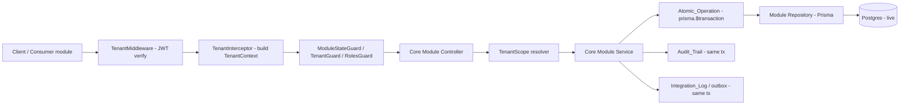
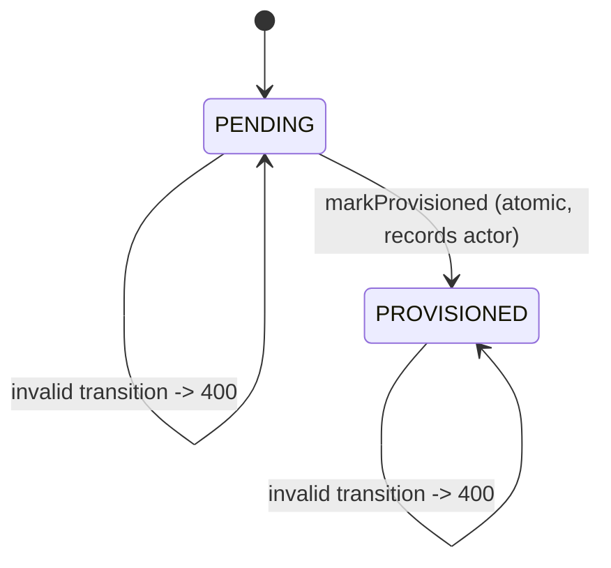
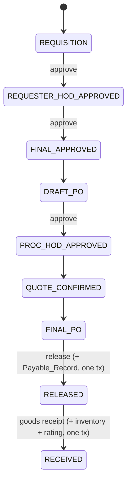
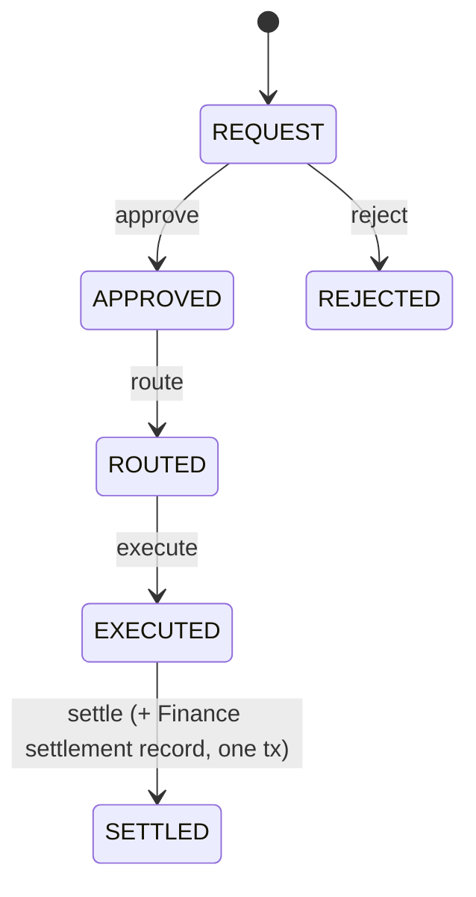

# Design Document

## Overview

This design describes how the five core operational departments — **IT, Procurement, Sales,
Marketing, and Payment** — are brought to production-grade by systematically exercising every
flow against the live database, fixing the recurring bug classes that block correctness, and
proving each module against the `tnt-3rlhko` live test tenant. The work is delivered in five
independently testable and deployable phases, one per module: **Phase 1 IT → Phase 2
Procurement → Phase 3 Sales → Phase 4 Marketing → Phase 5 Payment**.

Each module is a NestJS/TypeScript module under `backend/src/core/{it,procurement,sales,
marketing,payment}`, exposed under its own route namespace (`/it`, `/procurement`, `/sales`,
`/marketing`, `/payment`). They share a common layering:

- **Controllers** (`*.controller.ts`) — HTTP surface, request validation, response shaping,
  module-aware enrichment (Retail contributions).
- **Services** (`*.service.ts`, plus per-domain services such as `webhook.service.ts`,
  `social-sync.service.ts`, `payment.reconciliation.service.ts`) — business logic, state
  machines, transactions, audit, and domain-event emission.
- **Repositories** (`repositories/*.ts`) — data access via Prisma against the live Postgres
  database.
- **Entities / DTOs** (`entities/*.entity.ts`, `dto/*.dto.ts`) — typed persistence and request
  shapes.

The system is a live production deployment on a VPS. Changes deploy via `git push` to `main`
followed by a Docker rebuild and are validated live against production using `tnt-3rlhko`. HR
and Finance are stabilized in a parallel session; this spec treats them as **integration
dependencies and consumers**, verifying that the five core departments produce correct,
tenant-scoped data at the HR and Finance boundaries without modifying HR or Finance internals.

### Bug classes targeted

Investigation of the current code surfaced the concrete defect classes this design corrects:

1. **Actor identity sourced from unauthenticated headers.** `PaymentController.actor_id()`
   reads `request.headers["x-actor-id"]` and falls back to `"system"`, and several controllers
   pass `user_id || "system"` into services. Header-sourced actor identity is spoofable and
   violates Requirements 2.10 and 6.7. Actor identity must come from the verified
   `TenantContext.user_id`.

2. **Role gates missing on mutating endpoints.** The IT and Payment controllers declare
   `@UseGuards(ModuleStateGuard, BranchGatingGuard, TenantGuard)` with **no `RolesGuard`** and
   no `@Roles(...)` decorators on create/update/transition handlers, so privileged operations
   are not role-gated (Requirement 3.5).

3. **BUG-11 — Offline Payment Matrix not reliably enforced.** `PaymentService.isOfflineMode()`
   returns `process.env.OFFLINE_MODE === "true"` — a single global environment flag rather than
   the actual offline state of the payment context (device/branch connectivity). The matrix is
   therefore not enforced per payment context, and the blocked-method list is duplicated and
   drifts (`['CARD','QRIS','E_WALLET','LOYALTY_POINTS']` in one path, a different check in
   another). This violates Requirements 12.5 and 12.6.

4. **BUG-13 — Promises without rejection handlers.** Asynchronous work across modules
   (Marketing OAuth callbacks / social-sync, IT webhooks/device events, Payment expiry and
   reconciliation jobs) is initiated without attached rejection handlers, risking unhandled
   rejections that crash the process or silently drop work (Requirement 7).

5. **Non-atomic multi-write paths.** State transitions and their side effects (PO release +
   Payable_Record, goods receipt + inventory + supplier rating, lead conversion, settlement +
   Finance settlement record, lead handoff, creative-asset upload + record) are not consistently
   wrapped in a single transaction (Requirement 4).

6. **Field-name drift and hardcoded identifiers.** DTO camelCase vs schema snake_case mismatches
   silently drop values, and hardcoded values (currencies, ids) break correctness against the
   live DB (Requirements 5, 1.2).

7. **Mock / placeholder data in consumer-facing projections.** Overview and dashboard endpoints
   that feed Retail and cross-module consumers return placeholder or hardcoded values rather than
   persisted, tenant-scoped data (Requirement 6.10).

The design does not rewrite the modules wholesale. It establishes a small set of shared
correctness primitives — a tenant-scope resolver, an atomic-operation helper, a typed error
surface, a field-mapping discipline, and a real offline-context resolver — and applies them
phase-by-phase to the endpoints in each module, validating every write path against `tnt-3rlhko`.

## Architecture

### Request lifecycle (target state)



The baseline is already partly correct: every core controller runs behind `TenantInterceptor`
and reads `request.tenantContext`. The corrections are: (a) **every** mutating handler derives
its actor `user_id` from `TenantContext.user_id`, never from `x-actor-id` or `req.user`; (b)
`RolesGuard` is added to the IT and Payment guard chains and `@Roles(...)` is declared on every
mutating endpoint; and (c) every multi-write operation, including its audit entry and
integration-log event, runs inside one `prisma.$transaction`.

### Shared correctness primitives

Introduced once (reusing existing `MultiTenancyUtil` where possible) and applied across all five
phases:

1. **TenantScope resolver.** Converts a verified `TenantContext` into a validated `TenantScope`
   (`{ tenant_id, company_id?, location_id?, branch_id? }`) used to build every query `where`
   clause. Rules:
   - `tenant_id` is always taken from `TenantContext`; any client-supplied `tenant_id` is ignored.
   - `tenant_id` and `company_id` are treated as **distinct**; `company_id` is never substituted
     for `tenant_id` (Requirement 2.6).
   - `company_id`, `location_id`, and `branch_id` filters are validated to belong to the caller's
     `tenant_id` before being applied (Requirement 2.7); a mismatch is rejected (Requirement 2.4).
   - Privileged roles (`SUPERADMIN`, `OWNER`, `ADMIN`) may widen scope per Requirement 3.4;
     non-privileged roles are forced to their context scope (Requirement 2.8).

2. **Atomic_Operation helper.** A thin convention around `prisma.$transaction(async (tx) => …)`
   that threads `tx` through the repository write, the `Audit_Trail` write, the `Integration_Log`
   event (outbox `sys_outbox_events`), and any cross-module record (Payable_Record, settlement
   record, lead-handoff record) so that all of them commit together or roll back together
   (Requirements 4.1, 4.2, 4.4, 6.5, 6.6).

3. **Typed error surface.** Business-rule and lookup failures throw NestJS HTTP exceptions
   (`BadRequestException` 400, `NotFoundException` 404, `ForbiddenException` 403,
   `ConflictException` 409) instead of bare `Error`. A Prisma error-mapping layer translates
   `P2025`→404, `P2002`→409, `P2003`/`P2000`→400 so no validation or existence failure escapes as
   a 500 (Requirements 1.1, 1.2, 1.3, 7.3).

4. **Field-mapping discipline.** Each create/update path maps DTO fields to schema columns
   through an explicit, deterministic mapping (no blind spread of mismatched-casing objects into
   Prisma). A field that resolves to no schema column rejects the whole request with the
   unresolved field named, persisting nothing (Requirements 5.1–5.5).

5. **Offline-context resolver (BUG-11).** Replaces the global `process.env.OFFLINE_MODE` flag
   with a resolver that derives the offline state of the **specific payment context** (device /
   branch connectivity) for the request, and a single shared `Offline_Payment_Matrix`
   definition: `{ CASH, VOUCHER } permitted offline; { CARD, QRIS, E_WALLET, and any other
   gateway-backed method } blocked offline`. All payment-creation paths consult the one matrix
   (Requirements 12.5, 12.6).

6. **Async-rejection discipline (BUG-13).** Every initiated promise (webhooks, OAuth callbacks,
   social sync, scheduled jobs) attaches a rejection handler before execution; uncaught
   rejections are captured, recorded in the `Integration_Log`/`Audit_Trail` with timestamp,
   operation id, and cause, and do not terminate the process (Requirements 7.1, 7.2, 7.4, 7.5).

### Role gating model

`RolesGuard` reads required roles from the `@Roles(...)` decorator and the caller role from
`TenantContext.role`. `SUPERADMIN` is a global bypass; `OWNER` is a tenant-scoped bypass;
`ADMIN`/`MANAGER`/`MEMBER` must match the declared set. Every mutating core endpoint
(create/update/delete/approve/release/transition) must carry a `@Roles(...)` declaration; this
design audits each controller method and adds gates and the `RolesGuard` where missing
(Requirements 3.1–3.5). `ModuleStateGuard` continues to reject requests to a module that is
inactive for the tenant (Requirement 3.6).

### Phasing

| Phase | Module | Primary controllers/services | Representative tables |
|-------|--------|------------------------------|-----------------------|
| 1 | IT | `it.controller`, `it.service`, `webhook.service`, `it-event.handler` | `it_devices`, `it_device_events`, `it_provisioning_requests`, `it_system_health` |
| 2 | Procurement | `procurement.controller`, `procurement.service`, `workflows/*` | `suppliers`, `requisitions`, `purchase_orders`, `goods_receipts`, `contracts` |
| 3 | Sales | `sales.controller`, `sales.service`, `sales-management/operational.service` | `leads`, `opportunities`, `quotes`, `sales_orders`, `sales_tasks` |
| 4 | Marketing | `marketing.controller`, `marketing.service`, `social-sync.service`, `customer-360.service` | `campaigns`, `marketing_leads`, `connected_accounts`, `creative_assets` |
| 5 | Payment | `payment.controller`, `payment.service`, `payment.reconciliation.service`, `payment-expiry.job` | `payment_transactions`, `refunds`, `disputes`, `settlements`, `payment_devices` |

Each phase is self-contained at the controller/service/repository slice for its module, ships via
the existing git-push-to-`main` + Docker rebuild pipeline, can be tested against `tnt-3rlhko`
without any later phase, and must not break a previously completed phase (Requirements 14.1–14.5).

## Components and Interfaces

### TenantScope resolver

```typescript
interface TenantScope {
  tenant_id: string;
  company_id?: string;
  location_id?: string;
  branch_id?: string;
}

// Resolves the effective, validated scope for a request.
// Throws ForbiddenException/BadRequestException if a requested company/location/branch
// does not belong to tenant_id, or if a client-supplied scope id contradicts the context.
function resolveScope(
  ctx: TenantContext,
  requested?: { company_id?: string; location_id?: string; branch_id?: string },
): Promise<TenantScope>;
```

- Non-privileged callers: scope ids forced to context values.
- Privileged callers: requested filters honored, but validated to belong to `tenant_id`.
- `tenant_id` always wins over any client-supplied value.

### Controller contract (target, all core controllers)

```typescript
@Controller('payment')
@UseInterceptors(TenantInterceptor)
@UseGuards(ModuleStateGuard, BranchGatingGuard, TenantGuard, RolesGuard) // RolesGuard added
@RequiredModule('payment')
export class PaymentController {
  @Post('transactions')
  @Roles(UserRole.ADMIN, UserRole.MANAGER) // gate added on every mutating endpoint
  async createTransaction(
    @Req() request: RequestWithTenant,
    @Body() dto: CreatePaymentTransactionDto,
  ) {
    const scope = await this.scope.resolve(request.tenantContext);
    const actor = request.tenantContext.user_id; // NOT x-actor-id header
    return this.paymentService.createTransaction(scope, dto, actor);
  }
}
```

Migration changes per controller:
- Add `RolesGuard` to the guard chain and `@Roles(...)` to every mutating handler (IT, Payment).
- Replace `actor_id()` header reads and `user_id || "system"` fallbacks with
  `request.tenantContext.user_id` (Requirement 2.10).
- Pass a resolved `TenantScope` into services rather than a raw `tenant_id` string.

### IT service (Phase 1)

```typescript
getDevices(scope, filter): Promise<Device[]>
createDevice(scope, dto, user_id): Promise<Device>
updateDevice(scope, id, dto, user_id): Promise<Device>
createProvisioningRequest(scope, dto, user_id): Promise<ProvisioningRequest> // status = pending
markProvisioned(scope, id, user_id): Promise<ProvisioningRequest>            // pending -> provisioned (atomic)
ingestDeviceEvent(scope, dto): Promise<DeviceEvent>                          // rejects unknown device in scope
getOverview(scope): Promise<ITOverview>                                      // Retail contribution when active
```

Provisioning state machine:



### Procurement service (Phase 2)

```typescript
createSupplier/Requisition/DraftPO/Contract/...(scope, dto, user_id): Promise<T>
advanceRequisition(scope, id, target, user_id): Promise<Requisition>  // workflow edge, atomic
releasePurchaseOrder(scope, id, user_id): Promise<PurchaseOrder>      // PO release + Payable_Record (one tx)
recordGoodsReceipt(scope, dto, user_id): Promise<GoodsReceipt>        // receipt + inventory + supplier rating (one tx)
```

Procurement_Workflow:



Rules: a receipt whose quantity exceeds the outstanding ordered quantity is rejected with 400
and not persisted (Requirement 9.6); a Payable_Record missing a Finance-contract-required field
rolls back the release (Requirements 6.4, 9.10).

### Sales service (Phase 3)

```typescript
createLead/Opportunity/Quote/Task(scope, dto, user_id): Promise<T>
convertLead(scope, id, user_id): Promise<Opportunity>            // create opp + update lead (one tx)
moveOpportunityStage/closeOpportunity(scope, id, dto, user_id)   // pipeline edge, atomic
submitQuote/decideQuote(scope, id, dto, user_id)                 // quote edge, atomic
runSlaSweep(scope, user_id): Promise<SlaSweepResult>             // scoped only; records actor
```

Sales_Pipeline: `lead → (convert) opportunity → (stage) … → quote → (decision) order`. SLA sweeps
evaluate only records in the swept Tenant_Scope.

### Marketing service (Phase 4)

```typescript
createCampaign/Lead/Workflow/Asset(scope, dto, user_id): Promise<T>
transitionCampaign/Workflow/Account(scope, id, target, user_id)  // lifecycle edge, atomic
handoffLead(scope, leadId, user_id): Promise<LeadHandoff>        // handoff record + lead consumability (one tx)
uploadCreativeAsset(scope, dto, user_id): Promise<CreativeAsset> // store + register (one tx, no orphans)
getCustomer360(scope, customerId): Promise<Customer360>          // assembled only from in-scope records
handleOAuthCallback / runSocialSync(...)                         // BUG-13: rejection-safe, logged outcome
```

### Payment service (Phase 5)

```typescript
createTransaction(scope, dto, user_id): Promise<PaymentTransaction> // offline matrix enforced here
approve/reject/route/execute/settle(scope, id, dto, user_id)        // lifecycle edge, atomic
createRefund/approveRefund/executeRefund(...)                       // refund lifecycle, atomic
openDispute/progressDispute/resolveDispute(...)                     // dispute lifecycle, atomic
```

Payment_Lifecycle and the offline matrix:



Offline matrix (single shared definition, consulted by every create path):

| Method class | Online | Offline |
|--------------|--------|---------|
| CASH, VOUCHER | allowed | **allowed** |
| CARD, QRIS, E_WALLET, other gateway-backed | allowed | **blocked (400)** |

The offline state is resolved from the actual payment context (device/branch connectivity), not a
global env flag (BUG-11). Settlement creates the Finance settlement record and the settled state in
one transaction; if the Finance record fails, the whole operation rolls back with a 5xx
(Requirements 12.11, 12.12).

### Repository contract (all modules)

- Every read method filters by `tenant_id` (and resolved scope) in its `where` clause.
- Composite-key reads use `findFirst({ where: { id, tenant_id, … } })` rather than
  `findUnique({ where: { id } })`, satisfying Requirement 4.5 and preventing cross-tenant reads.
- Every write method accepts an optional `tx?: Prisma.TransactionClient` so it can participate in
  an Atomic_Operation.

## Data Models

Existing entities are retained; the design aligns their field names with schema columns and adds
explicit scope columns. All carry `tenant_id` (and where applicable `company_id`, `location_id`,
`branch_id`). All date/datetime values serialize to ISO 8601 in responses (Requirement 1.5).
Collections serialize as arrays, empty as `[]` not `null` (Requirement 1.6).

### IT (Phase 1)
- `Device { id, tenant_id, location_id?, device_code, name, type, status, ..., created_at, updated_at }`
- `ProvisioningRequest { id, tenant_id, device_id?, requested_by, status: 'PENDING'|'PROVISIONED',
  provisioned_by?, provisioned_at?, created_at, updated_at }`
- `DeviceEvent { id, tenant_id, device_id, event_type, payload, occurred_at }` — invariant: a
  `device_id` must reference a device in the same `tenant_id`.

### Procurement (Phase 2)
- `Supplier`, `SupplierBranch`, `SupplierProduct`, `Category`, `Requisition`, `PurchaseOrder`
  (`draft`/`final`/`released`), `GoodsReceipt`, `Contract`, `RiskSignal`, `PortalMessage` — all
  carry `tenant_id`. `PurchaseOrder` release produces a `Payable_Record` for Finance with the
  originating `tenant_id` and every contract-required field populated.

### Sales (Phase 3)
- `Lead { id, tenant_id, status, converted_opportunity_id?, … }`, `Opportunity { …, stage }`,
  `Quote { …, status }`, `SalesOrder`, `TimelineEvent`, `Task`. Lead conversion links lead →
  opportunity atomically.

### Marketing (Phase 4)
- `Campaign`, `Execution`, `MarketingLead { …, handoff_ready, consumable_by }`, `Contact`,
  `Workflow`, `ConnectedAccount`, `Funnel`, `CreativeAsset { id, tenant_id, storage_key, … }`,
  `LeadHandoff`. A creative asset's stored blob and its DB record are created/removed together.

### Payment (Phase 5)
- `PaymentTransaction { id, tenant_id, method_class, status:
  'REQUEST'|'APPROVED'|'REJECTED'|'ROUTED'|'EXECUTED'|'SETTLED', amount, currency, device_id?, … }`,
  `Refund { …, status: 'CREATED'|'APPROVED'|'EXECUTED' }`, `Dispute { …, status:
  'OPEN'|'IN_PROGRESS'|'RESOLVED' }`, `Settlement`, `PaymentDevice { …, status:
  'online'|'offline'|'maintenance' }`. Settlement creates a Finance settlement record in the same
  transaction as the settled state.

### Cross-cutting integration records
- `Audit_Trail` entry: `{ actor_user_id, action, resource_type, resource_id, tenant_scope, at }`.
- `Integration_Log` event (outbox `sys_outbox_events`): `{ event_type, tenant_scope, payload,
  delivery_status, recorded_at }`.

## Correctness Properties

*A property is a characteristic or behavior that should hold true across all valid executions of a
system — essentially, a formal statement about what the system should do. Properties serve as the
bridge between human-readable specifications and machine-verifiable correctness guarantees.*

This feature is well suited to property-based testing: tenant isolation, role gating, transactional
integrity, field-name fidelity, lifecycle validity, the offline payment matrix, and cross-module
contract conformance are universal rules that must hold across a large space of records, scopes,
roles, operations, and the five modules. The acceptance criteria collapse into a small set of
cross-cutting properties, each parameterized across the five phases and their record types.
Requirement 13.3 explicitly mandates five automated-test-checkable property concerns per phase —
tenant isolation, role gating, atomicity, cross-module integration correctness, and round-trip
persistence — which map directly to the tenant-isolation, role-gate, atomicity, cross-module, and
round-trip properties defined below.

These property tests use the live test tenant (`tnt-3rlhko`) plus an isolated secondary tenant for
cross-tenant assertions, and use fault injection at mockable repository/transaction boundaries for
atomicity.

### Property 1: Tenant-scoped reads never leak other tenants

*For any* two distinct tenants seeded with records of any core module, and any read (list, filtered
list, or get-by-id) issued by a non-privileged caller of one tenant, every returned record belongs
to that caller's `tenant_id` and permitted scope, an empty match yields `[]` (not an error), and a
get-by-id or mutation targeting a record owned by the other tenant returns a not-found response
with the resource unchanged.

**Validates: Requirements 1.4, 1.6, 2.1, 2.7, 2.8, 2.9, 6.1, 6.2, 8.1, 8.2, 8.8, 9.8, 9.11, 10.7, 11.12, 12.13**

### Property 2: Effective scope derives from verified context, not client input

*For any* create or write request whose body or headers supply a `tenant_id`, `company_id`,
`location_id`, or `branch_id` differing from the caller's verified `TenantContext`, the request is
rejected or the persisted record uses the context values; `company_id` is never substituted for
`tenant_id`; the actor recorded is `TenantContext.user_id` rather than any `x-actor-id` header; and
any requested scope id that does not belong to the caller's `tenant_id` is rejected with a
client-error response.

**Validates: Requirements 2.2, 2.3, 2.4, 2.5, 2.6, 2.10**

### Property 3: Mutating endpoints enforce their Role_Gate and module activation

*For any* mutating core endpoint and any caller role, the request is rejected with a forbidden (403)
response — performing no create/update/delete/approve/release operation and leaving data unchanged —
when the role is absent or neither in the endpoint's `@Roles` gate nor a permitted privileged bypass
(SUPERADMIN global, OWNER tenant-scoped), and permitted otherwise; every mutating handler declares a
`@Roles` gate; and a request to a module whose Module_Activation_State is inactive is rejected with
no operation on data.

**Validates: Requirements 3.1, 3.2, 3.3, 3.4, 3.5, 3.6**

### Property 4: Round-trip persistence of created and updated records

*For any* valid create or update of any core record type, reading the record back within the same
Tenant_Scope yields a record whose persisted fields equal the values supplied on the operation
(correct DTO-to-column mapping with no name/casing drops and no values written to a wrong column),
whose `tenant_id` equals the caller's context, with date fields serialized in ISO 8601; and a
request containing a field that resolves to no schema column is rejected with that field named and
nothing persisted.

**Validates: Requirements 5.1, 5.2, 5.3, 5.4, 5.5, 8.3, 8.6, 9.1, 10.1, 11.1, 12.1, 13.5, 13.6**

### Property 5: Multi-write operations are atomic

*For any* core operation that performs more than one database write — including its Audit_Trail
entry, Integration_Log event, and any cross-module record (Payable_Record, Finance settlement
record, lead-handoff record, creative-asset blob+record, inventory+rating on receipt) — injecting a
failure at any write point leaves the database unchanged: no record, audit log, integration event,
or cross-module record from that operation persists, and the entity remains in its pre-operation
state with an error response returned.

**Validates: Requirements 4.1, 4.2, 4.3, 4.4, 4.6, 4.7, 6.5, 6.6, 9.4, 9.5, 9.10, 10.3, 10.4, 11.5, 11.6, 11.7, 11.8, 12.11, 12.12**

### Property 6: Lifecycle transitions succeed only from valid states

*For any* stateful core entity (IT provisioning request, Procurement_Workflow entity, Sales_Pipeline
entity/quote, Marketing campaign/workflow/account, Payment transaction/refund/dispute) and any
requested transition, the transition succeeds and persists the new state (recording the actor from
context) if and only if it is a valid edge from the entity's current state; otherwise it is rejected
with a client-error response that identifies the current and rejected target state, leaving the
state unchanged and observably in exactly one defined status.

**Validates: Requirements 8.5, 8.9, 9.2, 9.3, 9.6, 9.7, 10.5, 10.6, 11.3, 11.4, 12.3, 12.4, 12.7, 12.8, 12.9, 12.10**

### Property 7: Offline payment matrix is enforced per context

*For any* payment-creation request, while the payment context is offline a cash or voucher method is
permitted and processed through the Payment_Lifecycle, and a card, QRIS, e-wallet, or any other
gateway-backed method is rejected with a client-error response identifying the method as unavailable
offline and no transaction is created; while online, all method classes are permitted.

**Validates: Requirements 12.5, 12.6**

### Property 8: Cross-module integration produces correct, tenant-scoped, complete data

*For any* core operation that reads from or writes to HR, Finance, Settings, the Integration_Log,
Audit, or Retail, the data exchanged is scoped to the caller's `tenant_id` (no other tenant's
records), every field required by the consuming module's contract is populated from persisted data
with no placeholder/mock/hardcoded values, a cross-module domain event is recorded in the
Integration_Log before the originating operation reports success, a privileged action records an
Audit_Trail entry with actor/action/resource/scope, and Retail contributions appear on
overview/dashboard responses if and only if the Retail Module_Activation_State is active.

**Validates: Requirements 6.3, 6.4, 6.7, 6.8, 6.9, 6.10, 8.10, 8.11, 8.12, 8.13, 9.4, 10.8, 10.9, 10.10, 11.9, 11.10, 11.11**

### Property 9: Valid requests never produce server errors; failures resolve as typed responses

*For any* valid, scoped request to any core endpoint, the response status is in 200–299 and
references no nonexistent column, invalid foreign key, or hardcoded identifier; inputs that fail
validation produce a 400–422 response naming each rejected field and persist nothing; missing
in-scope resources produce a 404; and any failing asynchronous operation within an endpoint resolves
within 30 seconds as a 4xx (client-caused) or 5xx (server-caused) response rather than a 500 leak or
an unresolved request.

**Validates: Requirements 1.1, 1.2, 1.3, 7.3, 8.7, 9.9, 12.2**

### Property 10: Asynchronous failures are caught, logged, and non-fatal

*For any* asynchronous operation a core module initiates (webhook, OAuth callback, social sync,
background/scheduled job), a rejection handler is attached before execution so no unhandled rejection
reaches the process level; a rejection is captured and recorded in the Integration_Log or
Audit_Trail with the failure timestamp, the failed operation's identifier, and an error description;
the process continues running; and a background job that fails on one item records the failure and
continues processing the remaining items.

**Validates: Requirements 7.1, 7.2, 7.4, 7.5, 11.10**

## Error Handling

The five modules standardize error handling so that no validation, lookup, business-rule, or
async failure escapes as an unintended HTTP 500 (Requirements 1.1–1.4, 7.3).

- **Validation errors.** DTOs use `class-validator`; the global `ValidationPipe` returns 400 for
  malformed payloads with a message naming each rejected field and its reason, and persists nothing
  (Requirements 1.3, 5.4, 8.7, 9.9, 12.2).
- **Business-rule violations.** Services throw typed NestJS exceptions instead of bare `Error`:
  invalid lifecycle transition → `BadRequestException` carrying the current and attempted state;
  goods-receipt over-quantity → `BadRequestException`; offline gateway payment → `BadRequestException`
  identifying the method class as unavailable offline; foreign scope id → `BadRequestException`/
  `ForbiddenException`.
- **Resource lookups.** Composite-key reads (`findFirst({ where: { id, tenant_id } })`) return
  `null` → controller maps to `NotFoundException` (404); cross-tenant ids therefore surface as 404,
  never as leakage, and the not-found message names only the resource type and requested id
  (Requirement 1.4).
- **Authorization.** `RolesGuard` throws `ForbiddenException` (403) for role failures and for a
  missing role; `ModuleStateGuard` rejects requests to an inactive module; `TenantGuard`/
  `TenantInterceptor` reject requests without a verified context (Requirements 2.3, 3.2, 3.3, 3.6).
- **Prisma errors.** A mapping layer translates `P2025`→404, `P2002`→409, `P2003`/`P2000`→400.
  Unmapped errors are logged and returned as 500 only as a last resort, never for the bug classes
  above (Requirement 1.2).
- **Transactions.** Any exception inside a `prisma.$transaction` callback rolls back the whole
  operation (Property 5), including audit logs, integration events, and cross-module records written
  with the same `tx`. A Finance settlement-record failure during settlement returns a 5xx and leaves
  the transaction pre-settlement (Requirement 12.12).
- **Cross-module read failures.** If HR or Finance returns unavailable/malformed/empty data, the
  core module returns an error or empty result to its caller and never another tenant's records
  (Requirement 6.2).
- **Asynchronous failures (BUG-13).** Every initiated promise attaches a rejection handler; uncaught
  rejections are captured, recorded in the Integration_Log/Audit_Trail with timestamp, operation id,
  and cause, and do not terminate the process; failing endpoint async work resolves within 30s as a
  typed 4xx/5xx; background jobs log per-item failures and continue (Requirements 7.1–7.5).
- **Hardcoded-identifier removal.** Currencies, company ids, and the offline state are resolved from
  persisted tenant/company/device records; failures raise descriptive `BadRequestException`s rather
  than proceeding with hardcoded values (Requirements 1.2, 12.5, 12.6).

## Testing Strategy

The feature uses a dual approach: property-based tests for the universal correctness properties
above, and example/integration tests for concrete scenarios, edge cases, and live-DB wiring.

### Property-based tests

- **Library:** `fast-check` with Jest (the backend's existing TypeScript/Jest toolchain). Property
  generation MUST NOT be hand-rolled.
- **Iterations:** each property test runs a minimum of 100 generated cases.
- **Tagging:** each property test is tagged with a comment referencing its design property, in the
  format: `// Feature: core-departments-stabilization, Property {number}: {property_text}`.
- **One test per property:** each of Properties 1–10 is implemented by a single property-based test,
  parameterized across the relevant phases/record types so the same property covers all five
  modules.
- **Generators:** custom arbitraries for `TenantContext` (varied tenant/company/location/branch/role,
  including spoofed/contradictory scope ids), per-module create/update DTOs (valid and adversarial),
  role sets, lifecycle states and transition requests, and payment method classes × online/offline
  context.
- **Isolation & atomicity:** cross-tenant properties seed two tenants; atomicity (Property 5) uses a
  mockable transaction/repository boundary to inject failures at each write point and assert no
  partial persistence.
- **Live verification:** read/round-trip properties (Properties 1, 4) execute against the live
  database using `tnt-3rlhko` per phase, satisfying Requirements 13.1, 13.5.

### Per-phase property coverage (Requirement 13.3)

For each of the five phases, the five mandated concerns are covered by: tenant isolation (Property 1),
role gating (Property 3), atomicity (Property 5), cross-module integration correctness (Property 8),
and round-trip persistence (Property 4). A phase is not complete while any of these five has not
passed against `tnt-3rlhko` (Requirements 13.4, 14.4).

### Example and edge-case unit tests

Focused, concrete tests complement the properties (kept minimal — properties cover the broad input
space):
- Offline gateway payment (CARD/QRIS/E_WALLET) returns 400; offline CASH/VOUCHER succeeds (BUG-11
  regression).
- Goods receipt exceeding outstanding quantity returns 400.
- PO release with a Payable_Record missing a Finance-required field rolls back (release + payable).
- Lead conversion failure leaves the lead unconverted.
- Creative-asset upload failure leaves no orphaned blob or record.
- Payment actor identity comes from `TenantContext.user_id`, not `x-actor-id` (regression).
- Field-mapping regressions: representative camelCase-DTO vs snake_case-column pairs map correctly.

### Integration / smoke tests (per phase, against `tnt-3rlhko`)

- Each phase's write paths are exercised against the real database; a verification run that surfaces
  a missing column, invalid FK, or hardcoded identifier blocks phase completion (Requirements 13.1,
  13.2).
- Finance integration: a released PO produces a balanced Payable_Record; a settled payment produces
  a Finance settlement record in the same transaction (Requirements 9.4, 12.11).
- Async wiring: Marketing OAuth/social-sync, IT webhooks, and Payment jobs run without unhandled
  rejections and record outcomes in the Integration_Log (Requirements 7, 11.10, 11.11).
- Consumer wiring: overview/dashboard endpoints return persisted, tenant-scoped data with Retail
  contributions gated on activation and no placeholder/mock values (Requirements 6.8–6.10, 8.10,
  8.11, 10.9, 10.10).

### Per-phase completion gate

A phase is complete only when, for the endpoints in its module: Properties 1–10 (as applicable) pass,
the example/edge tests pass, and the live `tnt-3rlhko` verification run is clean — satisfying
Requirements 1–7 for that phase, without breaking any previously completed phase and without
modifying HR or Finance internals (Requirements 13.4, 14.4, 14.5, 14.6, 14.7).
