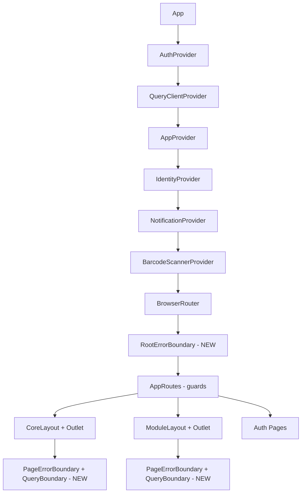
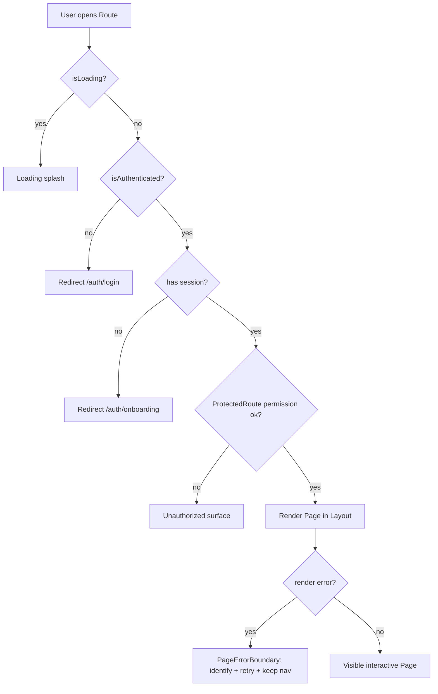
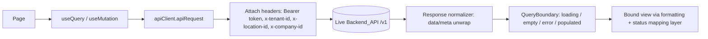
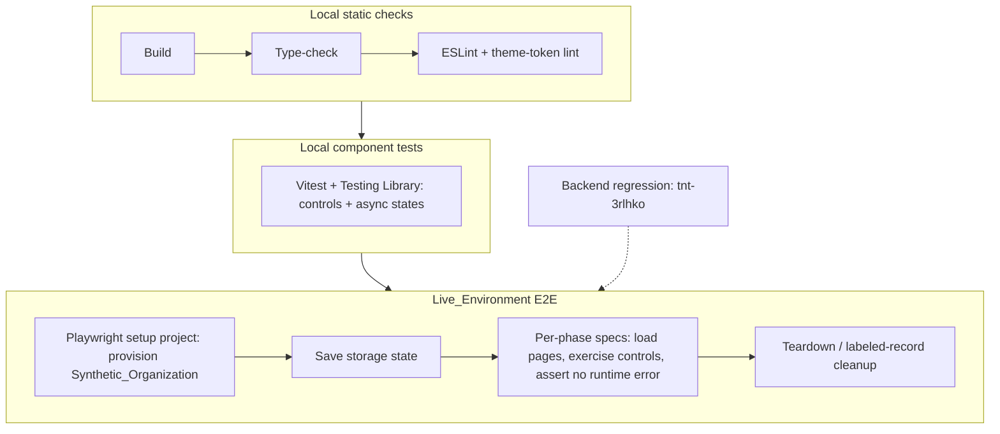

# Design Document

## Overview

This design describes how the Zenvix Web_App (a Vite + React 18 + TypeScript SPA built on
shadcn/ui, Tailwind, and an HSL-token glassmorphic design system) is stabilized so that every
Page renders without uncaught runtime errors, every Interactive_Control gives clear feedback,
every data view handles its Async_States, production screens bind Real_Data, the frontend tracks
the Backend_Contract, and the visual presentation is uniform across both Theme_Modes.

The work is decomposed into six independently testable and deployable **phases**, one per
Page_Group, mirroring the phased structure of the backend `core-departments-stabilization`
design:

| Phase | Page_Group | Layout(s) | Route prefix |
|-------|-----------|-----------|--------------|
| 1 | Auth & Onboarding | none (full-screen) | `/auth/*` |
| 2 | Core | CoreLayout | `/core/*` |
| 3 | Retail | ModuleLayout → RetailRootLayout | `/m/retail/*` |
| 4 | F&B | ModuleLayout | `/m/fnb/*` |
| 5 | Industry (Clinic, Farming) | ModuleLayout | `/m/clinic/*`, `/m/farming/*` |
| 6 | Portal | CoreLayout / module shells | `/core/portal`, `/m/*/portal` |

The design deliberately favors **shared cross-cutting primitives** over per-page rewrites. A
small set of standardized building blocks (an error boundary wrapper, a `QueryBoundary`
async-state component, a formatting utility layer, and a status/enum contract-mapping layer)
applied uniformly across the inventory of Pages is what drives most of the cross-cutting
requirements (Requirements 1, 3, 4, 5, 6, 7, 8). Each phase then becomes a finite checklist:
apply the primitives to the Pages in its group, fix that group's contract and data-binding gaps,
and prove the result against a freshly provisioned **Synthetic_Organization** on the
Live_Environment.

### Key findings from codebase investigation

- **Routing is runtime-generated.** `App.tsx` mounts `buildCoreRoutes()` (from
  `corePageResolver` + a large static block in `coreRoutes.tsx`) under `/core/*` and
  `buildModuleRoutes()` (from `moduleRegistry` → each `ModuleContract.getPages()`) under
  `/m/:moduleId/*`. There is **no error boundary** in the route tree — a render error in any
  Page bubbles to a blank screen. `ErrorBoundary` exists at
  `src/components/shared/ErrorBoundary.tsx` but is only wired into `DepartmentWorkspaceLayout`,
  not the route shells.
- **Auth/session guards** live inline in `App.tsx`: unauthenticated → `/auth/login`,
  authenticated-without-session → `/auth/onboarding`, otherwise render `CoreLayout`/`ModuleLayout`.
  `AuthContext` stores `ZENVIX_TOKEN` / `ZENVIX_SESSION` in `localStorage`; `apiClient.apiRequest`
  attaches `Authorization: Bearer`, `x-tenant-id`, `x-location-id`, `x-company-id`,
  `x-branch-id`, `x-actor-id`, `x-user-role` headers from the session.
- **The contract gap is confirmed.** `PaymentExecutionHub.tsx` gates the Approve button with
  `disabled={item.status !== "APPROVAL_PENDING"}` — the obsolete enum. The backend now emits
  `REQUEST_CREATED`.
- **Placeholder_Data leaks exist.** Several retail Pages import `formatCurrency`, `formatDate`,
  `formatTime`, `Product`, and `generateId` from `@/lib/mock-data`, while `CashierPOS` uses a
  different `@/lib/utils/currency` `formatCurrency`. Formatting is fragmented across at least two
  sources.
- **Theme tokens are well defined** in `tailwind.config.ts` (semantic colors mapped to
  `hsl(var(--...))`) and `src/lib/theme-colors.ts` already ships `isHardcodedColor()` and
  `convertToThemeColor()` helpers, plus a codemod at `scripts/fix-theme-colors.cjs`. Enforcement
  is not yet systematic.
- **Tooling is in place.** `vitest.config.ts` (jsdom, Testing Library), `playwright.config.ts`
  (targets the Live_Environment base URL with a `setup` project saving storage state to
  `tests/playwright/.auth/user.json`), an audit pipeline at `scripts/audit/run-full-audit.ts`,
  and an `architecture-guard.ts`. The current Playwright `auth.setup.ts` logs in with a
  hardcoded demo account — this is what changes to Synthetic_Organization provisioning.

## Architecture

### SPA shell and provider stack

The application is a single-page React app. `App.tsx` composes the provider stack and the route
tree. The provider order is fixed and the stabilization keeps it, inserting a top-level error
boundary inside `BrowserRouter` and route-level boundaries around the layout outlets.



### Routing and guard flow



The guard logic already exists in `App.tsx` and satisfies Requirement 1.5 / 1.6 in shape; the
design hardens it by ensuring the guarded subtree is wrapped so a thrown Page never takes down
`CoreLayout`/`ModuleLayout` navigation (Requirement 1.3), and by confirming the catch-all
`NotFound` route provides a recovery control (Requirement 1.4).

### Data flow



All domain reads/writes flow through `@tanstack/react-query` hooks calling
`apiClient.apiRequest`, which is the single place that attaches the auth token and tenant scope.
The `QueryClient` is configured with `retry: 1` and `refetchOnWindowFocus: false`. The
stabilization standardizes how the **result** of a query is presented (via `QueryBoundary`) and
how **values** are formatted and **enums** are mapped, without changing the transport layer.

### Theme system

Theme tokens are HSL variables in `src/index.css`, surfaced through Tailwind semantic utilities
declared in `tailwind.config.ts` (`background`, `foreground`, `primary`, `card`, `muted`,
`destructive`, `success`, `warning`, `info`, `sidebar-*`, `chart-*`, etc.). `next-themes` toggles
the `class` strategy (`dark`). Uniformity work (Requirements 7, 8) is therefore a matter of
**enforcing token usage** and **standardizing component selection** (Glass_Card, Button_Variant,
lucide-react icons), not redefining the token system.

### Phase independence

Each phase touches a disjoint set of Pages and can be built, verified, and deployed on its own.
Shared primitives (Phase 0 groundwork) are introduced first and are backward compatible, so a
phase that has not yet adopted them is not broken by their existence. A phase is "done" only when
its full Verification_Suite passes against a fresh Synthetic_Organization (Requirement 11.10).

## Components and Interfaces

### Phase 0 — Shared frontend primitives (groundwork)

These primitives are introduced before the phased page work and are the backbone of the
cross-cutting requirements.

#### 1. `PageErrorBoundary` (wraps the existing `ErrorBoundary`)

A thin wrapper that adapts the existing class `ErrorBoundary` for use at the route/outlet level
and standardizes the recovery affordance required by Requirement 1.3.

```tsx
// src/components/shared/PageErrorBoundary.tsx
interface PageErrorBoundaryProps {
  children: React.ReactNode;
  routeLabel?: string;          // identifies which Page failed
  onReset?: () => void;         // retry render without full reload where possible
}
```

- Renders an error surface that **identifies the failed Page** (`routeLabel`), offers a **retry**
  control and a **return-to-safe-route** control, and — critically — is mounted *inside* the
  Layout so the sidebar/header stay operable (Requirement 1.3).
- The existing `ErrorBoundary.handleReset` does `window.location.reload()`; `PageErrorBoundary`
  adds a soft reset (clear boundary state + `react-query` `reset`) and falls back to reload.
- A test hook `data-testid="error-boundary"` is added so Playwright can detect crash surfaces
  deterministically (the helpers already look for `h2:text-is('Runtime Exception')` and
  `[data-testid='error-boundary']`).

Mounting points: one `RootErrorBoundary` inside `BrowserRouter`; one `PageErrorBoundary` around
each layout `Outlet` (CoreLayout, ModuleLayout, RetailRootLayout shells), keyed by route so
navigating away resets it.

#### 2. `QueryBoundary` / `AsyncState` — standard async-state pattern

A single reusable component that maps a `react-query` result (or an explicit
loading/empty/error/data set) onto the four defined Async_State presentations (Requirements 4,
1.2, 3.9).

```tsx
// src/components/shared/QueryBoundary.tsx
interface QueryBoundaryProps<T> {
  query: Pick<UseQueryResult<T>, "isLoading" | "isError" | "data" | "refetch">;
  isEmpty?: (data: T) => boolean;     // default: array length 0 / null / undefined
  loading?: React.ReactNode;          // default: <SkeletonList/>
  empty?: React.ReactNode;            // default: <EmptyState/>
  error?: React.ReactNode;            // default: <ErrorState onRetry={refetch}/>
  children: (data: T) => React.ReactNode;   // populated render
}
```

Supporting presentational pieces (all token-based, Glass_Card-consistent):

- `LoadingSkeleton` — skeleton rows/cards shown within 1s and kept until terminal state
  (Requirement 4.1). A 30s watchdog flips a still-pending query to the error presentation
  (Requirement 4.6).
- `EmptyState` — explanatory text, **no** retry control (Requirements 4.3, 4.5).
- `ErrorState` — explanatory text **with** a retry control wired to `refetch` (Requirements 4.4,
  4.5, 4.7).

`QueryBoundary` distinguishes empty from error by construction (different components, error has
retry, empty does not), satisfying Requirement 4.5.

#### 3. Formatting utility layer + safe-value fallback

A single canonical module replaces the fragmented `@/lib/mock-data` and `@/lib/utils/currency`
formatters and provides the visible fallback required by Requirement 5.4.

```ts
// src/lib/format.ts  (canonical)
formatCurrency(value: number | null | undefined, currency?: string, locale?: string): string;
formatNumber(value: number | null | undefined, opts?: Intl.NumberFormatOptions): string;
formatDate(value: string | number | Date | null | undefined, style?: DateStyle): string;
formatDateTime(...): string;
safeText(value: unknown, fallback?: string): string;   // returns "—" for null/undefined/NaN/""
```

- Uses `Intl.NumberFormat` / `Intl.DateTimeFormat`; currency renders with symbol/code and digit
  grouping; numbers use digit grouping and consistent precision; dates use a consistent
  locale-appropriate format (Requirement 5.5).
- `safeText` (and `formatCurrency(undefined)`, etc.) never renders `undefined`, `null`, `NaN`, or
  empty string as user-facing text — they render the defined fallback `"—"` (Requirement 5.4).
- The legacy `@/lib/mock-data` formatters are re-exported as thin wrappers during migration, then
  removed once all imports point at `@/lib/format`. Mock domain data (`Product`, `generateId`,
  sample arrays) is removed from production Pages (Requirements 5.1, 5.2).

#### 4. Status-label + contract-enum mapping layer

A centralized, **total** mapping layer so the frontend tracks the Backend_Contract and guards
unknown enums (Requirement 6).

```ts
// src/lib/contract/paymentStatus.ts (one module per enum family)
export const PAYMENT_CREATE_STATE = {
  REQUEST_CREATED: "REQUEST_CREATED",
  APPROVED: "APPROVED",
  PROVIDER_SELECTED: "PROVIDER_SELECTED",
  EXECUTING: "EXECUTING",
  SETTLEMENT_PENDING: "SETTLEMENT_PENDING",
  SETTLED: "SETTLED",
  REJECTED: "REJECTED",
} as const;

// src/lib/contract/statusLabel.ts
export function statusLabel(value: string | null | undefined, family: StatusFamily): string;
//   → human label for known enum, defined fallback (e.g. "Unknown") for anything else,
//     never the raw/undefined/null value (Requirements 6.4, 6.6)

export function canApprovePayment(status: string | null | undefined): boolean;
//   → true ONLY when status === PAYMENT_CREATE_STATE.REQUEST_CREATED (Requirements 6.1, 6.2, 6.3)
```

- The `PaymentExecutionHub` Approve gate changes from `item.status !== "APPROVAL_PENDING"` to
  `disabled={!canApprovePayment(item.status)}`. The obsolete `APPROVAL_PENDING` is removed from
  the codebase (Requirement 6.3).
- `statusLabel` is **total**: every possible input string (including ones the contract does not
  define) returns a defined non-empty label, and a control gated on an unknown value stays
  disabled (Requirement 6.6).
- Status badge styling continues to flow through the existing `getStatusBadgeClasses` in
  `theme-colors.ts`, which is already token-based.

#### 5. Theme-token enforcement (lint/codemod) and component standardization

- **Lint rule / codemod**: extend the existing `scripts/fix-theme-colors.cjs` and add an ESLint
  guard (custom rule or `no-restricted-syntax` matching Tailwind palette classes such as
  `text-red-500`, `bg-emerald-100`) that flags Hardcoded_Color usage, building on
  `isHardcodedColor()` / `convertToThemeColor()` from `theme-colors.ts`. This makes Requirement
  7.1 / 8.4 enforceable in CI (Requirement 1.7).
- **Glass_Card standardization**: a single `GlassCard` surface component (wrapping the existing
  `glass-card` / `glass-morphism` classes) replaces ad-hoc card markup so card surfaces are
  uniform (Requirement 7.2).
- **Button_Variant standardization**: equivalent actions use the same shadcn `Button` variant
  (primary action = default, destructive = destructive, secondary = outline/secondary), audited
  per Page_Group (Requirement 7.3).
- **Icons**: standardize on `lucide-react` for equivalent affordances (Requirement 7.6).

### Existing components reused

- `ErrorBoundary` (`src/components/shared/ErrorBoundary.tsx`) — wrapped by `PageErrorBoundary`.
- `apiClient.apiRequest` — unchanged transport; the single token/tenant attachment point.
- `ProtectedRoute` (`src/core/security/ProtectedRoute.tsx`) — permission/scope gating, reused.
- shadcn `ui` primitives (`Button`, `Dialog`, `Select`, `Input`, `Badge`, `ScrollArea`,
  `toaster`/`sonner`) — Feedback_Message and Dialog focus behavior (Requirements 3.3, 3.6, 10.4).
- `getStatusBadgeClasses` / token utilities in `theme-colors.ts` — status styling.

### Page inventory per Page_Group

The following inventory is enumerated from `src/pages`, `src/modules/*/index.*`,
`corePageResolver.ts`, and `coreRoutes.tsx`. It is the concrete scope each phase must cover.

#### Phase 1 — Auth Page_Group (`src/pages/auth`, full-screen)

- `Login` (`/auth/login`)
- `Register` (`/auth/register`)
- `Onboarding` (`/auth/onboarding`) — 2-step company provisioning wizard (Nominatim geocoder,
  industry, region) calling `provisionCompany`
- `ForgotPasswordModal` (Dialog launched from Login)
- `Index` (`/` → redirects to `/core/dashboard`), `NotFound` (`*`)

#### Phase 2 — Core Page_Group (`src/pages/core`, CoreLayout)

Top-level: `Dashboard`, `Reports`, `Security`, `Settings` (+ `settings/:tab`), `ModuleHub`
(`/core/license`), `WorkflowInbox`, `Unauthorized`, `ReceiptStudio` (`/core/retail/receipt-studio`),
`Admin`, `Operations`, `Finance` (legacy entry), `InventoryModule`, `ProcurementEntry`.

- **Finance** workspace (`/core/finance/*`): `CFODashboard`, `MoneyDesk`, `TreasuryMap`,
  `LedgerCore`, `PayFlow`, `ReceivableDesk`, `PayableDesk`, `ClosePeriodStudio`, `AuditVault`,
  `FinanceInsights`, `InvoiceCapture`, `FinanceDocs`, `Assets`, `PolicyManager`, `JVDesk`,
  `PayslipStudio`, `FinancialOperationsDesk` (+ `BudgetPlanning`, `ReconciliationDesk`,
  `TaxCompliance`).
- **Payment** workspace (`/core/payment/*`): `PaymentDashboard`, `PaymentExecutionHub`
  *(contract-gap fix)*, `ProviderRoutingDesk`, `DeviceRoutingDesk`, `RefundDesk`,
  `DisputeCenter`, `PaymentAuditVault`.
- **Procurement** (`/core/procurement/*`): `PurchaseRequestDesk`, `SupplierDesk`, `ContractDesk`,
  `PoReleaseDesk`, `SupplierPortalDesk`, `ProcurementRiskCenter`, `ProcurementInsights`.
- **Inventory** (`/core/inventory/*`): `InventoryDashboard`, `InventoryStockHub`,
  `InventoryReceiving`, `InventoryAdjustments`, `TransferDesk`, `InventoryStockOpname`,
  `InventoryAuditLog`, `InventoryInsights`, `IotEventFeed`. **Warehouse** (`/core/warehouse/*`):
  `WarehouseManagement`.
- **IT** (`/core/it/*`): `ITDashboard`, `AccountDesk`, `DeviceDesk`, `SystemHealth`,
  `TopologyMap`, `RoleGovernance`, `TechShop`.
- **Sales** (`/core/sales/*`): `SalesOverview`, `SalesDashboard`, `LeadDesk`, `PipelineBoard`,
  `OpportunityDesk`, `QuoteDesk`, `TimelineDesk`, `SalesOrderDesk`, `ManagerDesk`, `ForecastDesk`,
  `SalesAuditLog`, `Customer360Desk`, `IncentiveDesk`, `SalesIntelligenceEngine`.
- **Marketing** (`/core/marketing/*`): `MarketingDashboard`, `CampaignDesk`, `ExecutionDesk`,
  `MarketingAnalytics`, `LeadCaptureDesk`, `NurtureStudio`, `ConnectedAccountsDesk`,
  `MarketingAlerts`, `MarketingAuditLog`, `Customer360Desk`, `Customer360`, `AppointmentDesk`,
  `FunnelBuilderDesk`, `OmnichannelInbox`, `CreativeLibrary`, `StrategyControlDesk`,
  `AutomationLab`.
- **HR** (`/core/hr/*`): `PulseDesk`, `RosterGrid`, `PeopleCore`, `OrgMap`, `VaultSpace`,
  `FlowGate`, `TalentFlow`, `SkillTrack`, `GrowthCycle`, `PayCycleStudio`, `SchedulingStudio`,
  `LexBoard`, `InsightLayer`, `CaseDesk`, `CaseDetail`, `DepartmentScheduleStudio`,
  `DepartmentAttendanceStudio`.
- **Cross-department / backbone**: `ComplianceCommand`, `LogisticsControlCenter`,
  `AdminWorkspace` (`RequestDesk`, `RequestAssign`, `RequestTrack`), `ToolsHome` +
  `DocumentTool`/`SpreadsheetTool`/`PresentationTool`/`CalculatorTool`/`ExportTool`/`Explorer`,
  `AuditHub`, `LogHub`, `BulletinHub`, `MailHub`, `ChatHub`, `WhiteLabelSettings`,
  per-department `schedule`/`attendance`/`admin`/`prs`/`portal`/`logs`/`audit-log`/`workflow`.

#### Phase 3 — Retail Page_Group (`src/modules/retail`, RetailRootLayout)

- Gateway: `RetailWorkspace` (`/m/retail/workspace`).
- Management plane: `StoreDashboard`, `StoreProfile`, `StaffAssignments`, `ShiftControl`,
  `EcommerceConnector`, `InfrastructureControl`, `OrderFulfillment`, `PricingPromoDesk`,
  `InventoryVisibility`, `DeviceControlCenter`, `ComplianceAuditLedger`, `InfrastructureMap`,
  `NexusCommand`, `WorkforceComplianceHub`, plus governance wrappers (`schedule`, `attendance`,
  `admin`, `prs`, `portal`, `logs`, `workflow`).
- Operational plane: `OperationalGateway`, `CashMovementTerminal`, `CashierPOS`,
  `RefundReturnDesk`, `StockOpnameScanner`, `ReceivingTerminal`, `SelfServiceKiosk`,
  `ShiftOpenTerminal`, `ShiftCloseTerminal` (device-gated via `DeviceAwareGuard`).

#### Phase 4 — F&B Page_Group (`src/modules/fnb` → `src/pages/fnb`, ModuleLayout)

- `Cashier` (`/m/fnb/cashier`), `Tables` (`/m/fnb/tables`), `Kitchen` (`/m/fnb/kitchen`,
  KDS-gated), `Inventory` (`/m/fnb/inventory`), `Settings` (`/m/fnb/settings`, hidden).

#### Phase 5 — Industry Page_Group (`src/pages/industry`, ModuleLayout)

- Clinic: `ClinicDesk` (`/m/clinic/desk`).
- Farming: `FarmDesk` (`/m/farming/desk`).
- Module-inactive handling per Requirement 16.4 (convey unavailable, do not render broken Page).

#### Phase 6 — Portal Page_Group

- `MyPulse` (`src/pages/portal/MyPulse.tsx`), surfaced as `/core/portal` and as each module's
  `portal` route (e.g. `/m/retail/management/portal`) via the `noShell` wrapper pattern.

## Data Models

The frontend does not own the domain schema; it consumes the Backend_Contract. The models below
are the **frontend-facing contract types and the new primitive types** this design introduces.

### Session and request scope (existing)

```ts
interface SessionContext {
  user_id: string;
  tenant_id: string;
  company_id?: string;
  location_id: string;
  branch_id?: string;
  ecommerce_id?: string;
  role: Role;
  department_id: string;
  token: string;
  permissions: string[];
}
```

`apiClient` derives request headers from this: `Authorization: Bearer <token>`, `x-tenant-id`,
`x-location-id`, `x-company-id`, `x-branch-id`, `x-ecommerce-id`, `x-actor-id`, `x-user-role`.
This is the authenticated tenant scope referenced by Requirements 5.1 / 13.2 / 14.3 / 15.3 /
16.2 / 17.2.

### Async_State model (new, conceptual)

```ts
type AsyncState<T> =
  | { kind: "loading" }
  | { kind: "empty" }
  | { kind: "error"; retry: () => void }
  | { kind: "populated"; data: T };
```

`QueryBoundary` is the single component that derives an `AsyncState` from a `react-query` result
and renders the matching presentation.

### Contract enum model (new)

```ts
// Payment create lifecycle — tracks Backend_Contract
type PaymentCreateState =
  | "REQUEST_CREATED" | "APPROVED" | "PROVIDER_SELECTED"
  | "EXECUTING" | "SETTLEMENT_PENDING" | "SETTLED" | "REJECTED";

interface StatusDescriptor {
  value: string;          // raw backend value
  label: string;          // human label (total fn: defined fallback for unknown)
  known: boolean;         // false → controls gated on it stay disabled
  badge: BadgeVariant;    // token-based styling
}
```

`PaymentTransaction` (existing, `src/core/types/payment/payment.ts`) keeps its shape; only the
**gating logic** changes from `APPROVAL_PENDING` to `canApprovePayment(status)`.

### Synthetic_Organization model (new, verification-only)

```ts
interface SyntheticOrg {
  runId: string;             // unique per verification run, used for namespacing
  label: string;            // e.g. "synthtest-<phase>-<runId>" — identifiable/cleanable
  tenantId: string;
  companyId: string;
  branchId: string;
  locationId: string;
  owner: { email: string; password: string; userId: string; token: string };
  extraUsers?: Array<{ role: Role; email: string; password: string; token: string }>;
  activatedModules: string[]; // module ids needed by the phase under test
  createdAt: string;
}
```

This fixture is produced by the provisioning harness (below), persisted as Playwright storage
state, and torn down after the run.

### Theme token model (existing)

Semantic Tailwind utilities backed by `hsl(var(--token))` (e.g. `bg-background`, `text-foreground`,
`bg-card`, `text-destructive`, `bg-success`, `border-border`, `bg-sidebar`). The design adds no
new tokens; it enforces their use over Hardcoded_Color.

## Verification Architecture

Verification is the heart of this effort. It targets the **Live_Environment** (the VPS
deployment, web client served at the deployed web URL with the Backend_API behind it) and, for
each phase, provisions a fresh **Synthetic_Organization** so the run reflects a brand-new real
customer rather than the accumulated legacy tenant. The live web URL, deploy mechanism, and
credentials are read from the repository's `vps_reference.md` / `vps_credentials.txt` at run time
(see "Secrets handling" below); they are never embedded in the design or in committed test code.



### Synthetic_Organization provisioning harness

A provisioning harness creates a fresh org on the Live_Environment per run. It prefers the
**real self-service flow** and only falls back to a documented privileged step where self-service
cannot reach (Requirements 11.4, 11.5, 11.6).

```ts
// tests/playwright/setup/provisionSyntheticOrg.ts
async function provisionSyntheticOrg(opts: {
  phase: string;
  modules: string[];           // module ids to activate for the phase
  extraRoles?: Role[];
}): Promise<SyntheticOrg>;
```

Provisioning sequence:

1. **Generate run identity.** `runId = synthtest-<phase>-<timestamp>-<rand>`; every created
   record's name/email is namespaced with this label (e.g. owner email
   `synthtest+<runId>@zenvix.test`) so synthetic data is identifiable and cleanable
   (Requirement 11.8).
2. **Self-service sign-up + onboarding (preferred path).** Drive the actual UI:
   `Register` → `Login` → `Onboarding` wizard (`provisionCompany`), exactly the flow a real
   customer uses. This both provisions the org and *is* the Phase 1 verification of
   auth/onboarding (Requirements 11.5, 12.5, 12.6). The wizard's geocoder step uses a fixed,
   deterministic location to avoid flakiness.
3. **Module activation.** Activate the modules the phase needs. Where the UI Module Hub
   (`/core/license`) exposes activation, drive it through the UI; where activation requires a
   privileged/seed step the self-service flow does not expose, perform it explicitly via a
   documented backend call (authenticated as the synthetic owner where possible) and **log the
   exact step performed** in the run output (Requirement 11.6).
4. **Extra users.** If the phase needs role-specific users (e.g. a cashier for Retail/F&B), create
   them under the same tenant, namespaced with the `runId`.
5. **Persist fixture.** Save the resulting session (token + tenant scope) as Playwright storage
   state at a per-run path (e.g. `tests/playwright/.auth/<runId>.json`) and emit the
   `SyntheticOrg` record for the phase specs to consume.

**Isolation & teardown.** Each run uses its own tenant, so data is isolated by construction
(Requirement 11.8). Teardown attempts, in order: (a) a documented cleanup API call that
soft-deletes/deactivates the synthetic tenant; (b) if no delete path exists, the org is left
inert but clearly labeled (`synthtest-*`) and a scheduled/manual cleanup job can reap labeled
tenants. The chosen approach for each environment is documented alongside the harness. Synthetic
orgs never write into the legacy tenant.

### Playwright project setup

`playwright.config.ts` already targets the Live_Environment base URL and uses a `setup` project
that saves storage state; the design extends this:

- **`setup` project** runs `provisionSyntheticOrg` for the phase under test and writes the
  per-run storage state. It replaces the current hardcoded-demo-credentials `auth.setup.ts`.
- **Per-phase spec projects** (`phase1-auth`, `phase2-core`, … `phase6-portal`) depend on the
  setup project, load each Page in the phase inventory, and for each Page:
  - assert the Page reaches a visible interactive state and emits **no uncaught runtime error**
    (see capture strategy below);
  - exercise key Interactive_Controls (open a Dialog and assert focus moves in/out, submit a
    representative Form, operate a table sort/filter, trigger a primary action) and assert a
    Loading_Indicator and Feedback_Message appear (Requirements 3, 14.2, 15.2, 17.4);
  - assert the view shows one of the defined Async_States (populated / Empty_State /
    Loading_Indicator / Error_State), never a blank screen (Requirements 1.2, 4).
- Specs run with `workers: 1` (the live server cannot handle concurrent sessions, per the existing
  config) and increased timeouts for remote latency.
- Reuse the existing `tests/playwright/utils/helpers.ts` (`assertRouteLoads`, `assertNoCrash`,
  `collectJSErrors`, `getSession`, `apiGet`) which already encode crash detection and session
  extraction.

### Console-error / network-error capture strategy

To satisfy "renders without uncaught runtime error" deterministically, each phase spec installs
listeners before navigation (extending the existing `collectJSErrors` helper):

- `page.on("pageerror", …)` — captures uncaught exceptions; **any** entry fails the Page.
- `page.on("console", msg => msg.type() === "error")` — captures console errors; entries matching
  runtime-error signatures (`TypeError`, `ReferenceError`, `Cannot read properties`,
  `is not defined`) fail the Page. A small, explicitly maintained `ignorePhrases` allowlist
  excludes known-benign third-party noise.
- `page.on("response", …)` / `page.on("requestfailed", …)` — records backend responses; 5xx on a
  Page's primary data request is reported (and asserted against, except where an endpoint is
  explicitly allowed to be transiently unavailable).
- DOM crash check — assert absence of the error-boundary surface
  (`[data-testid='error-boundary']`, `h2:text-is('Runtime Exception')`).

A Page passes only when: no `pageerror`, no matching console error, no unexpected 5xx on its
primary request, and no error-boundary surface.

### Vitest component tests (local, no live env)

`react-query`-driven control and async-state behavior is verified locally with Vitest + Testing
Library, mocking `apiClient`/`react-query` exactly as the existing
`procurementWorkspaceQueues.ui.test.tsx` does. These cover, per phase:

- `QueryBoundary` renders loading → populated → empty → error correctly, and the Error_State
  retry re-invokes `refetch` (Requirements 4.1–4.7).
- Interactive_Control feedback: clicking a primary action disables the control while pending and
  re-enables it after settle; success shows a Feedback_Message; failure re-enables and preserves
  input (Requirements 3.2–3.5).
- Dialog focus: opening moves focus in, closing returns focus to the trigger (Requirements 3.6,
  10.4).
- Form validation: invalid submit shows per-field messages, focuses the first invalid field, and
  does not submit (Requirement 3.8).
- Contract gating: `canApprovePayment` enables Approve **only** for `REQUEST_CREATED`
  (Requirements 6.1–6.3, 13.3); `statusLabel` returns a defined fallback for unknown values and
  keeps gated controls disabled (Requirement 6.6).

### Backend regression tenant

`tnt-3rlhko` (the `Live_Test_Tenant`) remains the **backend** regression tenant. The existing
`tests/integration/*` and the API-regression portions of the Playwright suite authenticate with
this tenant for Backend_API regression checks against live production (Requirement 11.9).
Frontend page verification never uses it — it always uses a fresh Synthetic_Organization.

### Static checks and audit pipeline

- Production build (`vite build`), TypeScript type-check (`tsc --noEmit`), and ESLint must all
  complete with zero errors, including the new theme-token lint rule (Requirements 1.7, 11.1).
- The existing audit pipeline (`scripts/audit/run-full-audit.ts`) and `architecture-guard.ts`
  continue to run as part of the suite.

### Secrets handling

The harness reads the live web URL, deploy target, and credentials from the repository reference
files (`vps_reference.md`, `vps_credentials.txt`) or, preferably, from environment variables
populated from them at run time. Credential **values** are never written into the design,
committed test code, or logs; tests reference them by key name (e.g. `VITE_API_URL`,
`SYNTH_OWNER_PASSWORD`). The deploy mechanism is unchanged: push to `main` → VPS `git pull` +
`docker compose up -d --build`.

## Correctness Properties

*A property is a characteristic or behavior that should hold true across all valid executions of
a system — essentially, a formal statement about what the system should do. Properties serve as
the bridge between human-readable specifications and machine-verifiable correctness guarantees.*

This feature is primarily an integration/e2e and component-test effort. Most acceptance criteria
concern UI rendering, navigation, timing, responsiveness, accessibility, and live-environment
verification, which are validated by Playwright e2e and Vitest component tests rather than
property-based tests. Property-based testing is therefore kept **light** and applied only to the
handful of pure, total functions introduced by the shared primitives (the async-state mapping,
the formatting layer, and the contract enum/label/gating layer), plus one light totality property
over the enumerated route inventory.

### Property 1: Async-state mapping is total and exclusive

*For any* `react-query`-style result (a combination of loading / error / data-present /
data-empty), `QueryBoundary` renders **exactly one** of the four defined presentations
(Loading_Indicator, Error_State, Empty_State, populated content) and never a blank container;
furthermore the Error_State always exposes a retry control and the Empty_State never does.

**Validates: Requirements 1.2, 4.2, 4.3, 4.4, 4.5**

### Property 2: Safe-value formatting never leaks empty/invalid text

*For any* input value — including `null`, `undefined`, `NaN`, empty string, numbers, strings,
and dates — the formatting layer (`safeText`, `formatCurrency`, `formatNumber`, `formatDate`,
`formatDateTime`) returns a defined, non-empty string and never returns the literal text
`"undefined"`, `"null"`, `"NaN"`, or `""`.

**Validates: Requirements 5.4**

### Property 3: Formatting output invariants

*For any* finite number, `formatCurrency` output contains a currency symbol or currency code and
applies digit grouping, and `formatNumber` applies digit grouping with consistent precision; *for
any* valid date input, `formatDate` produces output in a single consistent, locale-appropriate
pattern.

**Validates: Requirements 5.5**

### Property 4: Contract gating correctness

*For any* status string received from the Backend_API, a control gated on that status is enabled
**if and only if** the value equals the current Backend_Contract enabling value; in particular,
`canApprovePayment(s)` is true exactly when `s === "REQUEST_CREATED"`, and is false for the
obsolete `"APPROVAL_PENDING"`, for any other defined state, and for unknown/`null`/`undefined`
values.

**Validates: Requirements 6.1, 6.2, 6.3, 6.6, 13.3**

### Property 5: Status-label mapping is total

*For any* status string (including values the current Backend_Contract does not define, and
`null`/`undefined`), `statusLabel` returns a defined, non-empty human-readable label — a known
value maps to its contract label, and any unknown value maps to a defined fallback label rather
than the raw, `undefined`, or `null` value.

**Validates: Requirements 6.4, 6.6**

### Property 6: Every defined Route renders without an uncaught runtime error

*For any* Route in the enumerated route inventory (the routes produced by `buildCoreRoutes` and
`buildModuleRoutes` for a Synthetic_Organization user with the phase's modules active), loading
that Route reaches a visible interactive state and emits no uncaught runtime error and no
error-boundary surface. This property is driven by the per-phase Playwright suite parameterized
over the route inventory, rather than by a classic in-memory generator.

**Validates: Requirements 1.1, 13.1, 14.1, 15.1, 16.1, 17.1**

## Error Handling

### Render-time errors (React)

- A `RootErrorBoundary` inside `BrowserRouter` catches catastrophic failures and renders a
  recoverable surface (retry + return to a safe Route).
- A `PageErrorBoundary` wraps each Layout's `Outlet`, keyed by route. A thrown Page renders the
  error surface (identifying the failed Page) **inside** the Layout, so the sidebar/header and
  Navigation_Controls remain operable (Requirement 1.3). The boundary offers a soft retry
  (reset boundary state + `react-query` reset) and a hard fallback (reload / return to
  `/core/dashboard`).
- Boundaries expose `data-testid="error-boundary"` and the existing `Runtime Exception` heading
  so the verification suite can detect crashes deterministically.

### Data-fetch errors (react-query)

- `QueryBoundary` renders the Error_State (explanatory text + retry) on `isError`, and a 30s
  watchdog converts a still-pending initial request into the Error_State (Requirements 4.4, 4.6,
  4.7). Retry calls `refetch` and returns the view to its Loading_Indicator.
- `apiClient` already throws `ApiError(message, status, data)` on non-2xx and defensively
  unwraps `{ data, meta }`. Hooks surface `ApiError.message` to `QueryBoundary`/Feedback_Message.
- The API base URL legacy circuit-breaker and JSON-parse guards in `api-config.ts` /
  `AuthContext` are retained (they prevent HTML-error-page parse crashes).

### Action errors (mutations)

- An Interactive_Control that triggers a request is disabled while in flight and re-enabled
  within the settle window (Requirement 3.5). On failure it shows a Feedback_Message via the
  toast system, re-enables, and preserves user-entered input so the action can be retried without
  re-entry (Requirement 3.4).

### Contract / unknown-enum handling

- Unknown or obsolete enum values flow through `statusLabel` (defined fallback label) and the
  gating functions (control stays disabled). The raw unknown value is never rendered as a status
  and never enables a gated control (Requirement 6.6).

### Missing/optional fields

- All displayed values pass through `safeText` / the formatting layer, which renders the defined
  fallback (`"—"`) instead of `undefined`/`null`/`NaN`/empty string (Requirement 5.4).

### Auth / guard failures

- Unauthenticated access to a guarded Route redirects to `/auth/login`; authenticated-without-
  session redirects to `/auth/onboarding`; permission failure renders the `Unauthorized` surface
  via `ProtectedRoute` (Requirements 1.5, 1.6). Undefined Routes render `NotFound` with a
  recovery control (Requirement 1.4).

## Testing Strategy

A dual approach is used: **example/e2e tests** carry the bulk of verification (this is mostly UI,
navigation, theming, responsiveness, accessibility, and live-environment behavior), and a
**light set of property-based tests** covers the pure functions introduced by the shared
primitives.

### Property-based tests (light)

- **Library**: `fast-check` integrated with Vitest (do not hand-roll generators).
- **Iterations**: minimum 100 per property.
- **Tagging**: each test references its design property, e.g.
  `// Feature: frontend-stabilization, Property 4: Contract gating correctness`.
- **Scope** (one property-based test each):
  - Property 1 → `QueryBoundary` async-state totality (generate result combinations).
  - Property 2 → safe-value formatting totality (generate arbitrary values incl. null/undefined/
    NaN/empty/number/string/date).
  - Property 3 → formatting output invariants (generate finite numbers and valid dates).
  - Property 4 → contract gating (`canApprovePayment` / generic gate) over arbitrary strings.
  - Property 5 → `statusLabel` totality over arbitrary strings incl. null/undefined.
  - Property 6 → route-render totality, implemented as a Playwright suite parameterized over the
    enumerated route inventory (e2e-backed rather than in-memory generated).

### Vitest component tests (local, no live env)

Following the existing `procurementWorkspaceQueues.ui.test.tsx` mocking pattern (`apiClient`,
`react-query`, `AuthContext`), per phase:

- Async-state rendering and Error_State retry behavior (Requirements 4.1–4.7).
- Interactive_Control feedback: disable-while-pending, re-enable on settle, success/failure
  Feedback_Message, preserved input on failure (Requirements 3.2–3.5).
- Dialog focus in/out (Requirements 3.6, 10.4); Form validation focus + messages (Requirement
  3.8).
- Contract gating and label mapping at the component level (Requirements 6.1–6.6, 13.3).
- Accessibility: `axe-core` scans and Testing Library focus/keyboard assertions for accessible
  names, focus order, and label association (Requirements 10.1–10.5). Full WCAG conformance still
  requires manual assistive-technology testing and expert review; automated checks cover the
  basics only.

### Playwright e2e tests (live env, Synthetic_Organization)

- `setup` project provisions a fresh Synthetic_Organization (driving the real sign-up/onboarding
  flow; documenting any privileged bootstrap step) and saves per-run storage state.
- Per-phase spec projects load each Page in that phase's inventory and assert: no uncaught runtime
  error (pageerror / console-error / unexpected 5xx / no error-boundary surface); a defined
  Async_State is shown (never blank); key controls function with Loading_Indicator + Feedback_
  Message; navigation reachability, active state, and SPA navigation; responsive behavior at
  multiple viewports; theme toggling without reload and body-text contrast.
- `workers: 1`, increased timeouts for remote latency, traces/screenshots on failure (existing
  config). Teardown cleans up or clearly labels synthetic records (Requirement 11.8).

### Static checks and regression

- Production build, `tsc --noEmit`, and ESLint (including the new theme-token rule and a guard
  that production Pages do not import `@/lib/mock-data`) must complete with zero errors
  (Requirements 1.7, 5.2, 7.1, 11.1).
- The audit pipeline (`scripts/audit/run-full-audit.ts`) and `architecture-guard.ts` run as part
  of the suite.
- Backend_API regression checks against live production use the `Live_Test_Tenant` `tnt-3rlhko`
  (Requirement 11.9).
- A phase is incomplete until every check in its Verification_Suite passes (Requirement 11.10).
