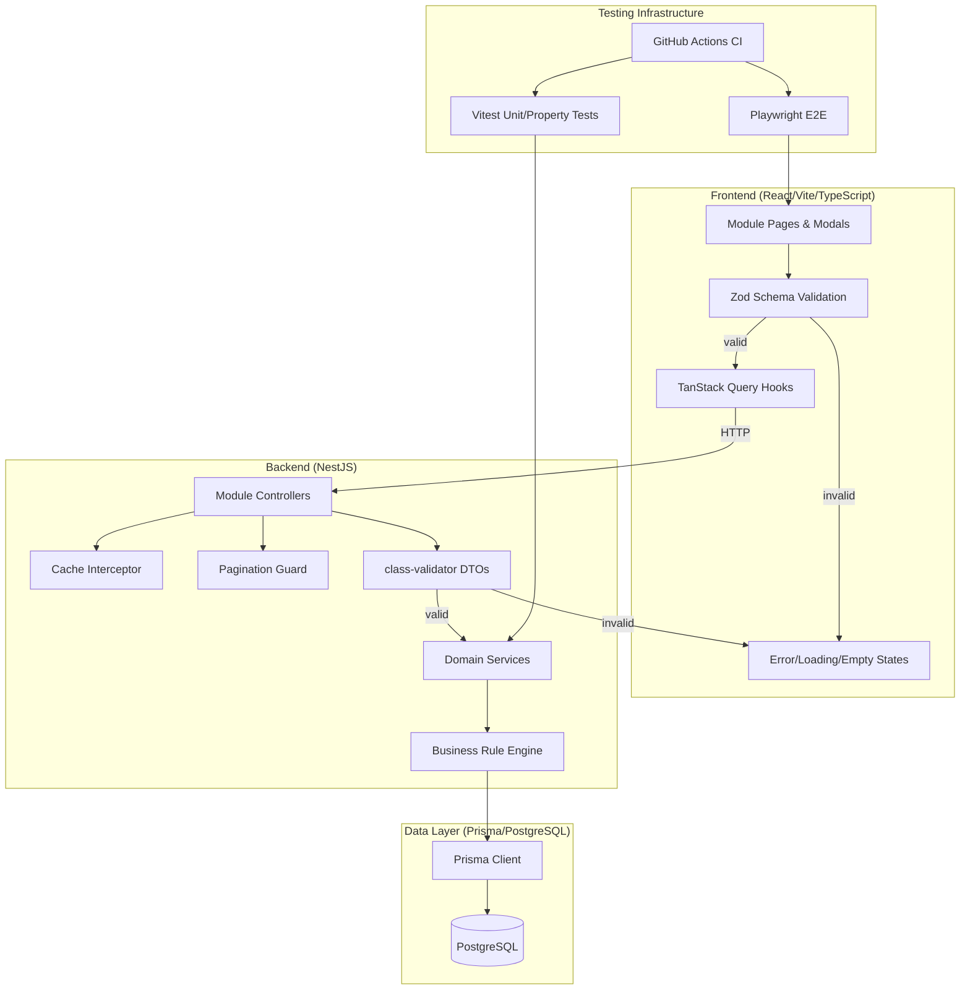
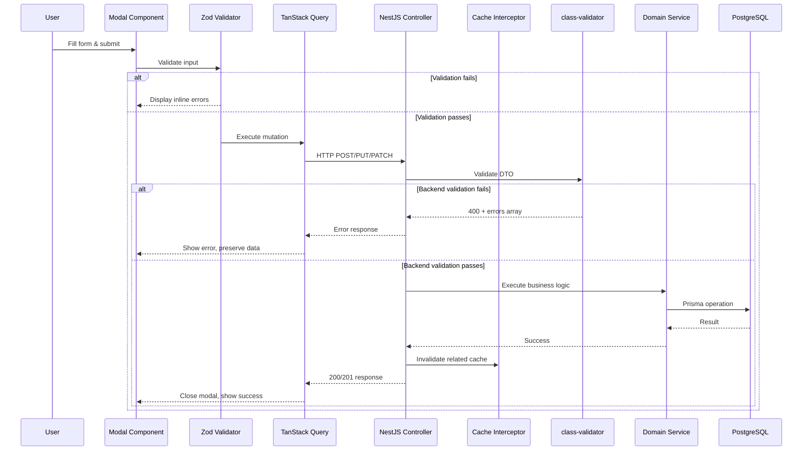

# Design Document: Full Module Production Audit

## Overview

This design addresses the production-readiness remediation of all 8 core business modules in the Zenvix Business Flow Suite. The current system-wide readiness score is 65.7% with all modules at "no-go" status. The remediation targets:

- **165 stub modals** across all modules replaced with fully functional forms
- **28 stub elements** replaced with data-driven components
- **15 mock-data integrations** replaced with real TanStack Query hooks
- **8 disconnected API endpoints** resolved in the Inventory module
- **29+ unguarded `findMany()` calls** equipped with pagination guards
- **All GET endpoints** covered by cache interceptors
- **8 complete E2E workflow tests** covering all critical business paths
- **Zod + class-validator** input validation on all form submissions and API endpoints

The architecture follows a layered approach: frontend modal components → API service layer (TanStack Query) → backend controllers → Prisma services → PostgreSQL, with cross-cutting concerns (pagination, caching, validation, audit trail) applied uniformly.

## Architecture



### High-Level Data Flow



## Components and Interfaces

### Frontend Components

#### 1. Modal Form Component Pattern

Every stub modal is replaced with a consistent pattern:

```typescript
// Generic modal form structure (applied per module)
interface ModalFormProps<T extends z.ZodSchema> {
  schema: T;                          // Zod validation schema
  defaultValues: z.infer<T>;         // Initial form state
  onSubmit: (data: z.infer<T>) => Promise<void>;
  onCancel: () => void;
  title: string;
  isOpen: boolean;
}

// Implementation uses react-hook-form + @hookform/resolvers/zod
function ModuleModal<T extends z.ZodSchema>({
  schema, defaultValues, onSubmit, onCancel, title, isOpen
}: ModalFormProps<T>) {
  const form = useForm({ resolver: zodResolver(schema), defaultValues });
  // Renders Dialog with form fields, validation errors, submit/cancel actions
}
```

#### 2. TanStack Query Hook Pattern

Replace mock data with standardized query hooks:

```typescript
// Paginated list query pattern
interface PaginatedResponse<T> {
  data: T[];
  totalCount: number;
  currentPage: number;
  pageSize: number;
  totalPages: number;
}

function useModuleList<T>(
  endpoint: string,
  params: { page?: number; pageSize?: number; filters?: Record<string, unknown> }
) {
  return useQuery<PaginatedResponse<T>>({
    queryKey: [endpoint, params],
    queryFn: () => apiClient.get(endpoint, { params }),
    staleTime: 30_000, // Match backend cache TTL
  });
}

// Mutation pattern with cache invalidation
function useModuleMutation<TInput, TOutput>(
  endpoint: string,
  method: 'POST' | 'PUT' | 'PATCH' | 'DELETE',
  invalidateKeys: string[]
) {
  const queryClient = useQueryClient();
  return useMutation<TOutput, ApiError, TInput>({
    mutationFn: (data) => apiClient[method](endpoint, data),
    onSuccess: () => {
      invalidateKeys.forEach(key => queryClient.invalidateQueries({ queryKey: [key] }));
    },
  });
}
```

#### 3. Error/Loading/Empty State Components

```typescript
// Shared state components used across all modules
interface QueryStateProps {
  isLoading: boolean;
  isError: boolean;
  error?: ApiError;
  isEmpty: boolean;
  onRetry: () => void;
  children: React.ReactNode;
}

function QueryStateWrapper({ isLoading, isError, error, isEmpty, onRetry, children }: QueryStateProps) {
  if (isLoading) return <LoadingSpinner />;
  if (isError) return <ErrorState message={error?.message} onRetry={onRetry} />;
  if (isEmpty) return <EmptyState />;
  return <>{children}</>;
}
```

### Backend Components

#### 4. Pagination Guard (NestJS Pipe)

```typescript
// Shared pagination pipe applied to all list endpoints
interface PaginationParams {
  page: number;    // >= 1
  pageSize: number; // 1-200, default 50
}

@Injectable()
class PaginationPipe implements PipeTransform {
  transform(value: any): PaginationParams {
    const page = parseInt(value.page) || 1;
    const pageSize = Math.min(parseInt(value.pageSize) || 50, 200);
    if (page < 1 || pageSize < 1) throw new BadRequestException('Invalid pagination params');
    return { page, pageSize };
  }
}

// Usage in controllers:
@Get()
@UseInterceptors(CacheInterceptor)
@CacheTTL(30)
async findAll(@Query(PaginationPipe) pagination: PaginationParams) {
  const skip = (pagination.page - 1) * pagination.pageSize;
  const [data, totalCount] = await Promise.all([
    this.service.findMany({ skip, take: pagination.pageSize }),
    this.service.count(),
  ]);
  return {
    data,
    totalCount,
    currentPage: pagination.page,
    pageSize: pagination.pageSize,
    totalPages: Math.ceil(totalCount / pagination.pageSize),
  };
}
```

#### 5. Cache Interceptor Configuration

```typescript
// Cache module configuration
@Module({
  imports: [
    CacheModule.register({
      ttl: 30,           // Default 30s for transactional data
      max: 1000,         // Max cache entries
    }),
  ],
})
export class AppModule {}

// Per-endpoint TTL override for reference data
@Get('reference-data')
@UseInterceptors(CacheInterceptor)
@CacheTTL(300) // 5 minutes for slowly-changing reference data
async getReferenceData() { /* ... */ }

// Cache invalidation on writes
@Post()
async create(@Body() dto: CreateDto) {
  const result = await this.service.create(dto);
  await this.cacheManager.reset(); // Invalidate controller's cache
  return result;
}
```

#### 6. Validation DTO Pattern

```typescript
// Backend validation with class-validator
class CreatePurchaseOrderDto {
  @IsNotEmpty()
  @IsString()
  vendorId: string;

  @IsArray()
  @ArrayMinSize(1)
  @ValidateNested({ each: true })
  @Type(() => LineItemDto)
  lineItems: LineItemDto[];
}

class LineItemDto {
  @IsPositive()
  quantity: number;

  @IsPositive()
  unitPrice: number;

  @IsString()
  @IsNotEmpty()
  itemId: string;
}

// Global validation pipe returning structured errors
@Injectable()
class GlobalValidationPipe implements PipeTransform {
  transform(value: any, metadata: ArgumentMetadata) {
    // Returns 400 with { errors: [{ field, message }] }
  }
}
```

#### 7. Business Rule Engine — State Machine

```typescript
// State transition adjacency maps per module
const PROCUREMENT_STATE_MAP: Record<string, string[]> = {
  draft: ['pending_approval'],
  pending_approval: ['approved', 'draft'], // Can return to draft
  approved: ['received'],
  received: ['closed'],
  closed: [], // Terminal state
};

function validateTransition(currentState: string, targetState: string, stateMap: Record<string, string[]>): boolean {
  const validTargets = stateMap[currentState];
  if (!validTargets) return false;
  return validTargets.includes(targetState);
}

// Stock balance enforcement
function validateStockAdjustment(currentBalance: number, delta: number): { valid: boolean; error?: string } {
  const newBalance = currentBalance + delta;
  if (newBalance < 0) {
    return { valid: false, error: `Insufficient stock: current=${currentBalance}, delta=${delta}` };
  }
  return { valid: true };
}
```

#### 8. Inventory Disconnected Endpoint Resolution

```typescript
// New backend endpoints to resolve disconnected API calls
@Controller('inventory')
class InventoryController {
  @Get('movements')
  async getMovements(
    @Query('item_id') itemId: string,
    @Query(PaginationPipe) pagination: PaginationParams
  ) { /* paginated movements filtered by item_id */ }

  @Get('balances')
  async getBalances(
    @Query('item_id') itemId: string,
    @Query(PaginationPipe) pagination: PaginationParams
  ) { /* stock levels filtered by item_id */ }

  @Get('items/:id/images')
  async getItemImages(@Param('id') id: string) { /* image array */ }

  @Put('items/:id/images/:imageId/primary')
  async setPrimaryImage(
    @Param('id') id: string,
    @Param('imageId') imageId: string
  ) { /* set primary flag */ }

  @Post('items/:id/images')
  @UseInterceptors(FileInterceptor('file'))
  async uploadImage(
    @Param('id') id: string,
    @UploadedFile(new MaxFileSizeValidator({ maxSize: 10 * 1024 * 1024 })) file: Express.Multer.File
  ) { /* persist file, return metadata */ }

  @Patch('items/:id')
  async updateItem(@Param('id') id: string, @Body() dto: UpdateItemDto) { /* partial update */ }

  @Delete('items/:id')
  async softDeleteItem(@Param('id') id: string) {
    // Sets deleted_at, does NOT remove row
    return this.service.update(id, { deletedAt: new Date() });
  }
}

// Route prefix resolution for /v1/ mismatch
@Controller({ path: 'inventory', version: ['1', ''] }) // Handles both /v1/ and / prefixes
class InventoryVersionedController { /* ... */ }
```

### Security Module Layout Fix

```typescript
// CoreLayout wraps with <main> — nested modules must NOT add their own <main>
// SecurityModule: replace <main> with <div> or <section>
function SecurityPage() {
  return (
    <section className="security-content"> {/* NOT <main> */}
      {/* Security module content */}
    </section>
  );
}
```

## Data Models

### Pagination Response Envelope

```typescript
interface PaginatedResponse<T> {
  data: T[];
  totalCount: number;
  currentPage: number;
  pageSize: number;
  totalPages: number;
}
```

### Validation Error Response

```typescript
interface ValidationErrorResponse {
  statusCode: 400;
  message: string;
  errors: Array<{
    field: string;
    message: string;
  }>;
}
```

### Audit Trail Entry

```typescript
interface AuditTrailEntry {
  id: string;
  userId: string;
  timestamp: string; // ISO-8601
  action: string;    // "create" | "update" | "delete" | "approve" | ...
  entityType: string;
  entityId: string;
  changes?: Record<string, { old: unknown; new: unknown }>;
  tenantId: string;
}
```

### State Machine Configuration

```typescript
interface StateTransitionMap {
  [currentState: string]: string[]; // Array of valid target states
}

// Procurement PO states
const PO_STATES: StateTransitionMap = {
  draft: ['pending_approval'],
  pending_approval: ['approved', 'draft'],
  approved: ['received'],
  received: ['closed'],
  closed: [],
};

// IT Ticket states
const TICKET_STATES: StateTransitionMap = {
  open: ['assigned'],
  assigned: ['in_progress'],
  in_progress: ['escalated', 'resolved'],
  escalated: ['in_progress', 'resolved'],
  resolved: ['closed', 'in_progress'],
  closed: [],
};
```

### Quotation Line Item Calculation

```typescript
interface QuotationLineItem {
  itemId: string;
  quantity: number;       // > 0
  unitPrice: number;      // > 0
  discountType: 'percentage' | 'fixed';
  discountValue: number;  // >= 0
}

function calculateLineTotal(item: QuotationLineItem): number {
  const subtotal = item.quantity * item.unitPrice;
  if (item.discountType === 'percentage') {
    return subtotal * (1 - item.discountValue / 100);
  }
  return subtotal - item.discountValue;
}

function calculateGrandTotal(items: QuotationLineItem[]): number {
  return items.reduce((sum, item) => sum + calculateLineTotal(item), 0);
}
```

### Stock Adjustment Model

```typescript
interface StockAdjustment {
  itemId: string;
  delta: number;          // Non-zero (positive = add, negative = remove)
  reason: string;         // 1-500 characters
  performedBy: string;    // User ID
  timestamp: string;      // ISO-8601
}

// Invariant: currentBalance + delta >= 0
```

### Journal Entry (Double-Entry Accounting)

```typescript
interface JournalLineItem {
  accountCode: string;  // Non-empty
  debitAmount: number;  // >= 0
  creditAmount: number; // >= 0
  description?: string;
}

interface JournalEntry {
  lineItems: JournalLineItem[]; // Minimum 2
  // Invariant: sum(debits) === sum(credits) within tolerance 0.01
}

function isBalanced(entry: JournalEntry): boolean {
  const totalDebits = entry.lineItems.reduce((s, l) => s + l.debitAmount, 0);
  const totalCredits = entry.lineItems.reduce((s, l) => s + l.creditAmount, 0);
  return Math.abs(totalDebits - totalCredits) <= 0.01;
}
```

## Correctness Properties

*A property is a characteristic or behavior that should hold true across all valid executions of a system — essentially, a formal statement about what the system should do. Properties serve as the bridge between human-readable specifications and machine-verifiable correctness guarantees.*

### Property 1: Double-Entry Accounting Balance Validation

*For any* journal entry containing line items with arbitrary debit and credit amounts, the system SHALL allow submission if and only if the absolute difference between total debits and total credits is less than or equal to 0.01 AND the entry contains at least 2 line items. Conversely, for any entry that violates either constraint, submission SHALL be rejected.

**Validates: Requirements 2.2, 2.4**

### Property 2: State Machine Transition Enforcement

*For any* entity with a current state and any attempted target state, the system SHALL allow the transition if and only if the target state exists in the adjacency map for the current state. For any (current, target) pair not in the adjacency map, the system SHALL reject the transition, leave the entity in its original state with no persisted changes, and return an error indicating the current state and attempted target.

**Validates: Requirements 3.4, 17.2, 17.6**

### Property 3: Quotation and POS Line Item Arithmetic

*For any* set of line items where each has a positive quantity, positive unit price, and a non-negative discount (percentage 0-100 or fixed amount up to line subtotal), the calculated line total SHALL equal `quantity × unitPrice × (1 - discountPercent/100)` for percentage discounts or `quantity × unitPrice - fixedDiscount` for fixed discounts, and the grand total SHALL equal the sum of all line totals.

**Validates: Requirements 4.4, 8.2**

### Property 4: Pagination Offset Correctness and Metadata Consistency

*For any* valid pagination request where page ≥ 1 and 1 ≤ pageSize ≤ 200, the query offset SHALL equal `(page - 1) × pageSize`, the returned result set size SHALL be ≤ pageSize, and the metadata SHALL satisfy `totalPages = ceil(totalCount / pageSize)` and `currentPage = page`. For any invalid pagination parameters (page < 1, pageSize < 1, pageSize > 200, or non-numeric), the system SHALL reject with a validation error.

**Validates: Requirements 11.1, 11.3, 11.4, 11.5**

### Property 5: Stock Balance Non-Negativity Invariant

*For any* sequence of stock adjustment operations on an inventory item, the system SHALL maintain the invariant that `currentBalance + delta ≥ 0` after each operation. For any adjustment where the resulting balance would be negative, the system SHALL reject the operation and leave the balance unchanged.

**Validates: Requirements 7.4, 7.5, 17.1**

### Property 6: Order Fulfillment Atomicity

*For any* sales order with N line items, if the available inventory for ANY single line item is less than the ordered quantity, the system SHALL reject the entire fulfillment operation and leave ALL stock balances unchanged (no partial deduction). Conversely, if ALL line items have sufficient stock, the system SHALL deduct from all simultaneously.

**Validates: Requirements 17.3, 17.4**

### Property 7: Backend Validation Error Response Structure

*For any* invalid request payload sent to any backend endpoint, the system SHALL return a 400 status code with a JSON body containing a `message` string and an `errors` array where every element has a non-empty `field` string and a non-empty `message` string describing the validation failure.

**Validates: Requirements 16.2, 16.3**

## Error Handling

### Frontend Error Strategy

| Scenario | Behavior |
|----------|----------|
| Zod validation failure | Inline field-level errors, form data preserved, submit disabled |
| Network timeout (30s) | Toast error message, retry button, form data preserved |
| HTTP 4xx response | Parse `errors` array, show field-level or summary errors, modal stays open |
| HTTP 5xx response | Generic "operation failed" toast, form data preserved, modal stays open |
| Empty API response | Empty-state component with descriptive message |
| Loading state | Spinner/skeleton within 100ms of request start |

### Backend Error Strategy

| Scenario | Response |
|----------|----------|
| DTO validation failure | 400 + `{ errors: [{ field, message }] }` |
| Business rule violation | 400 + `{ message: "...", errors: [...] }` |
| Invalid state transition | 400 + `{ message: "Invalid transition from X to Y" }` |
| Entity not found | 404 + `{ message: "Resource not found" }` |
| Unexpected error | 500 + `{ message: "Internal server error" }` (stack trace logged server-side only) |
| File too large (>10MB) | 413 + `{ message: "File exceeds maximum size of 10MB" }` |

### Cache Error Handling

- Cache miss: Proceed with database query, populate cache on success
- Cache service unavailable: Bypass cache, serve directly from database (graceful degradation)
- Cache invalidation failure: Log warning, serve stale data for remainder of TTL

## Testing Strategy

### Testing Approach

The testing strategy uses three complementary layers:

1. **Property-Based Tests (Vitest + fast-check)**: Verify universal correctness properties across randomized inputs
2. **Unit Tests (Vitest)**: Verify specific examples, edge cases, and error conditions
3. **E2E Tests (Playwright)**: Verify complete business workflows end-to-end

### Property-Based Testing Configuration

- **Library**: `fast-check` (already in devDependencies)
- **Runner**: Vitest
- **Minimum iterations**: 100 per property test
- **Tag format**: `Feature: full-module-production-audit, Property {N}: {title}`

Each correctness property maps to a single property-based test:

| Property | Test File | What Varies |
|----------|-----------|-------------|
| 1: Double-Entry Balance | `src/__tests__/audit-journal-entry.pbt.test.ts` | Line item counts, debit/credit amounts, imbalance magnitudes |
| 2: State Transitions | `src/__tests__/audit-state-machine.pbt.test.ts` | Current states, target states, entity types |
| 3: Line Item Arithmetic | `src/__tests__/audit-line-calculations.pbt.test.ts` | Quantities, prices, discount types/values |
| 4: Pagination | `src/__tests__/audit-pagination.pbt.test.ts` | Page numbers, page sizes, total counts |
| 5: Stock Non-Negativity | `src/__tests__/audit-stock-balance.pbt.test.ts` | Current balances, adjustment sequences, delta magnitudes |
| 6: Fulfillment Atomicity | `src/__tests__/audit-fulfillment.pbt.test.ts` | Order sizes, stock levels per item, mixed sufficient/insufficient scenarios |
| 7: Validation Response | `src/__tests__/audit-validation-response.pbt.test.ts` | Payload shapes, field types, nested objects, missing fields |

### Unit Testing Targets

- Modal open/close/cancel behavior (per module)
- Error state rendering (network failure, timeout, 4xx, 5xx)
- Empty state rendering
- Loading state timing
- Form data preservation on error
- Specific validation edge cases (boundary values)
- Priority assignment logic (IT tickets)
- SLA breach detection thresholds

### E2E Testing (Playwright)

8 complete workflow tests as specified in Requirement 19:

| Test Suite | Workflow Steps |
|-----------|---------------|
| HR | Create employee → Assign department → Submit leave → Approve leave → Process payroll |
| Finance | Create journal entry → Post to ledger → Reconcile → Generate report |
| Procurement | Create PO → Approve → Receive goods → Verify inventory → Generate invoice |
| Sales | Create lead → Convert to opportunity → Create quotation → Convert to order → Fulfill |
| Retail POS | Open shift → Scan items → Apply discount → Process payment → Close shift → Verify history |
| Inventory | Create item → Set stock → Transfer → Adjust → Run opname → Verify counts |
| Marketing | Create campaign → Define audience → Schedule → Execute → Verify metrics |
| IT | Create ticket → Assign priority → Escalate on SLA breach → Resolve → Close |

**CI Integration**: All E2E tests run in GitHub Actions on push to main and PRs targeting main. Failure artifacts include screenshots, network logs, and assertion messages.

### Test Infrastructure

```typescript
// Playwright test configuration for CI
// playwright.config.ts additions:
{
  reporter: [
    ['html'],
    ['json', { outputFile: 'test-results/results.json' }],
  ],
  use: {
    screenshot: 'only-on-failure',
    trace: 'retain-on-failure',
    video: 'retain-on-failure',
  },
}

// GitHub Actions workflow
// .github/workflows/e2e.yml:
// - Runs on push to main and PRs to main
// - Starts backend + frontend services
// - Executes playwright tests
// - Uploads failure artifacts
```

### Readiness Verification

After all remediation is complete, re-run the production audit:
```bash
npm run audit
```

All 8 target modules must score ≥ 90% with zero E2E workflow failures and zero high-severity performance issues.
