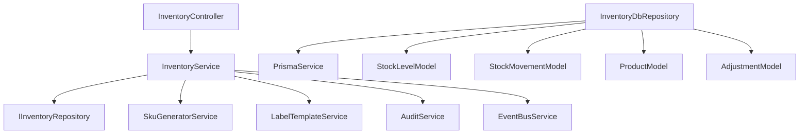

# Dependency Graph - Inventory Department

## Internal Dependencies (Core)

## External Dependencies (External Packages)

| Package | Use Case |
| --- | --- |
| `@nestjs/common` | Base framework decorators |
| `@prisma/client` | Type-safe Database Access |
| `uuid` | Trace ID generation |
| `class-validator` | DTO validation logic |
| `exceljs` | Bulk import/export processing |

## Risk Analysis: Circularity
- **Detection**: None. `InventoryModule` is standalone within the `core` folder.
- **Tight Coupling**: `InventoryService` has high coupling with `SkuGeneratorService`, which is expected but should be monitored.
- **Persistence**: Deep dependency on `PrismaService`. Database migration is required for any logic change.
