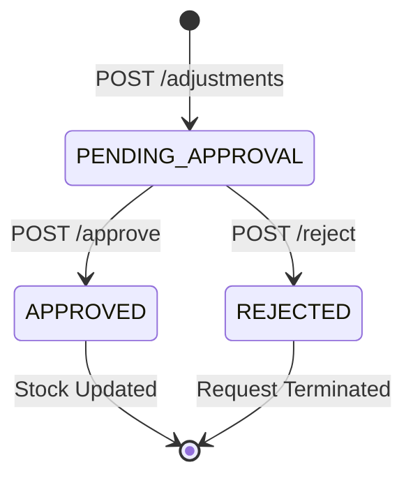
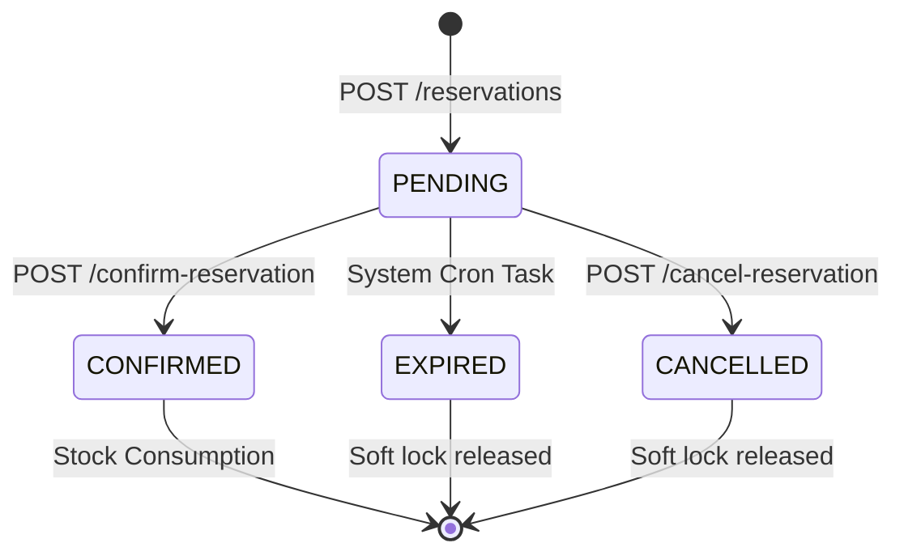

# State Machine - Inventory Department

## 1. Inventory Adjustment Lifecycle
Formal reconciliation of recorded stock vs physical count.

## 2. Stock Reservation Lifecycle
Soft-locking mechanism for retail orders or internal projects.

## 3. Inventory Item Status
Global status of the Item Master.

- **DRAFT**: Created via system ingestion, requires verification.
- **ACTIVE**: Ready for stock moves and sales.
- **INACTIVE**: Temporarily hidden from UI but records preserved.
- **DELETED**: Logical deletion (marked as `deleted_at`).
