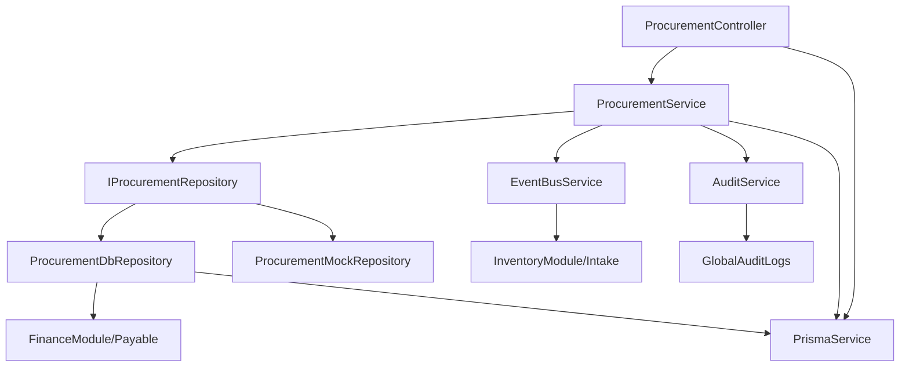

# Dependency Graph: Procurement

## 1. Internal Dependencies
- **Core Strategy**: `ProcurementService`
- **Persistence Abstract**: `IProcurementRepository`
- **Persistence Concrete**: `ProcurementDbRepository` / `ProcurementMockRepository` (Polymorphic Injection)

## 2. Infrastructure Dependencies
- **Data**: `PrismaService` (PostgreSQL)
- **Logging**: `AuditService`
- **Orchestration**: `EventBusService` (Redis-based pub/sub simulation)

## 3. Peripheral Dependencies
- **Finance**: Direct record creation in `Payable` table (Transactionally coupled).
- **Inventory**: Event-driven notification through `PO_RECEIVED`.
- **Security**: `TenantInterceptor`, `ModuleStateGuard`, `BranchGatingGuard`.
