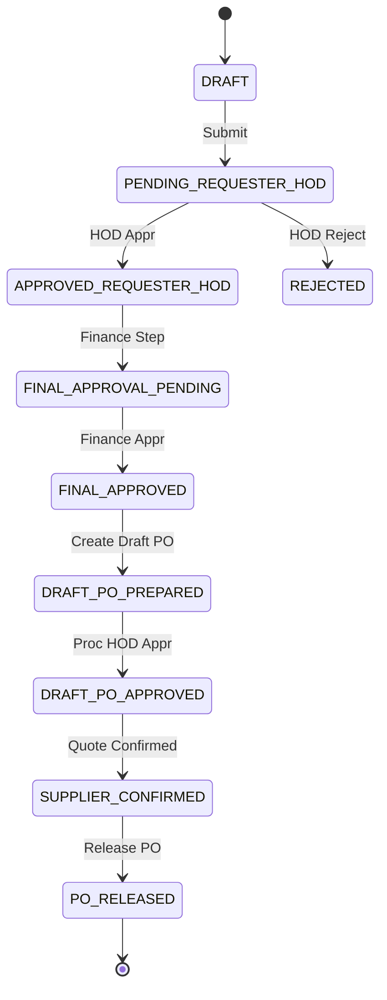
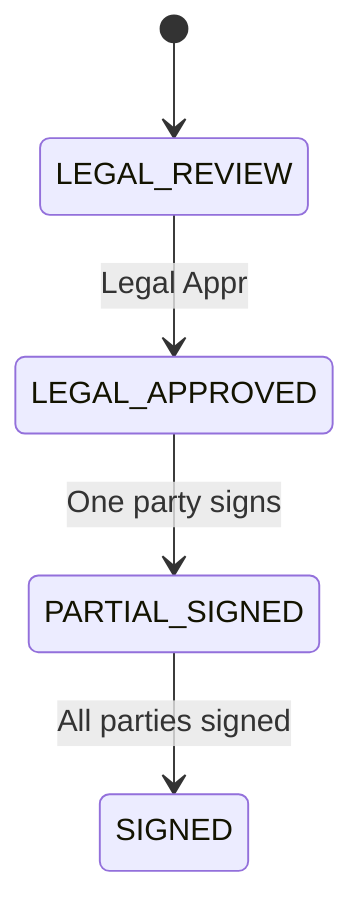
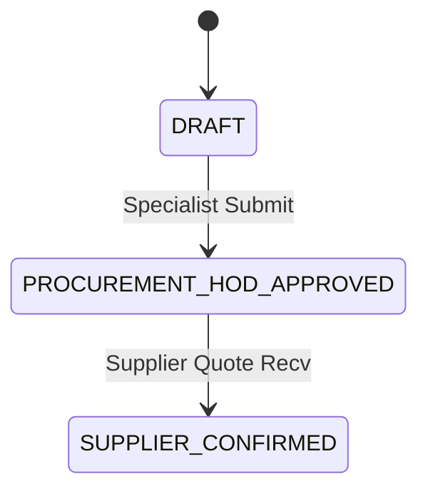
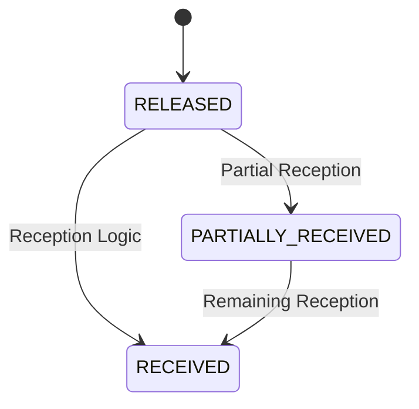

# State Machine: Procurement

## 1. Purchase Requisition (PR)
Defines the lifecycle of a purchase intent.

## 2. Procurement Contract
High-value purchase legal wrapper.

## 3. Draft Purchase Order
Internal coordination document.

## 4. Final Purchase Order
External legal commitment.

